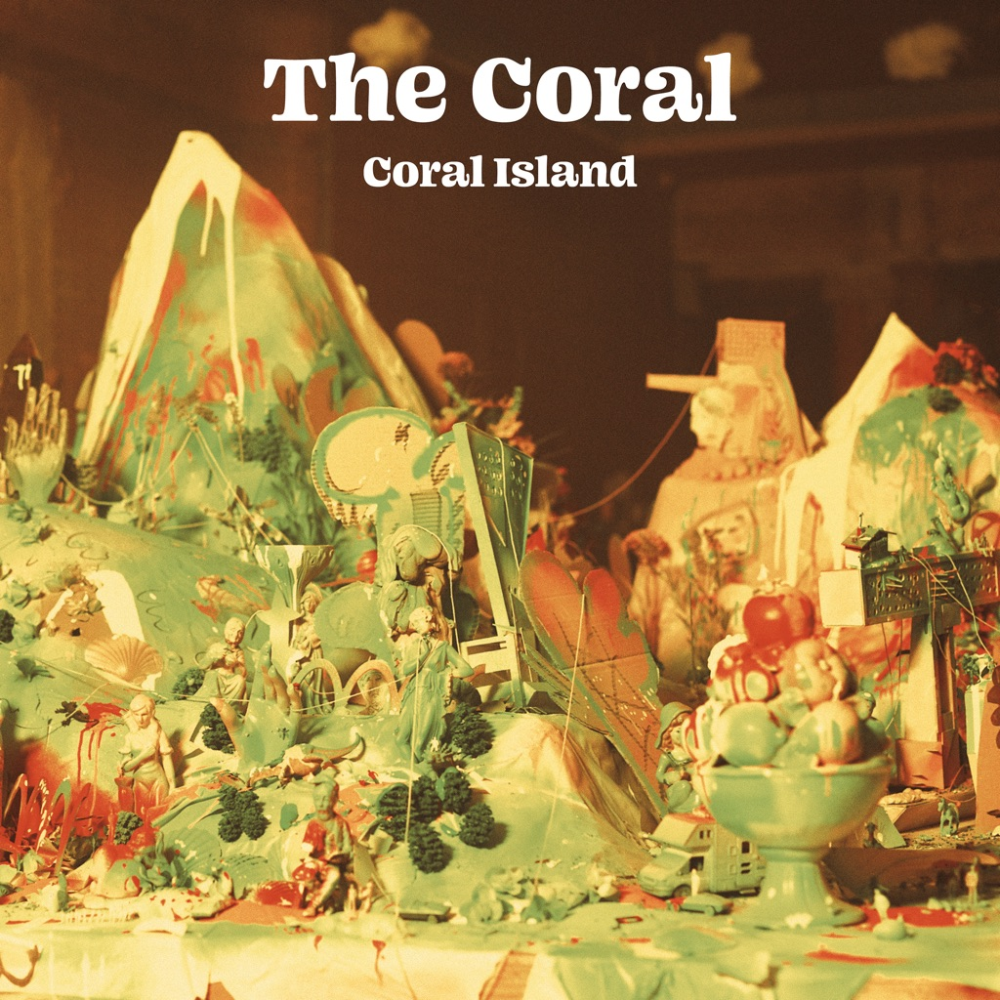

<!-- section break -->

1. Part 1 - Welcome To Coral Island
2. Lover Undiscovered
3. Change Your Mind
4. Mist On The River
5. Pavillions Of The Mind
6. Vacancy
7. My Best Friend
8. Arcade Hallucinations
9. The Game She Plays
10. Autumn Has Come
11. End Of The Pier
12. The Ghost Of Coral Island
13. Golden Age
14. Faceless Angel
15. The Great Lafayette
16. Strange Illusions
17. Take Me Back To The Summertime
18. Telepathic Waltz
19. Old Photographs
20. Watch You Disappear
21. Late Night At The Borders
22. Land Of The Lost
23. The Calico Girl
24. The Last Entertainer

<!-- section break -->

## Spotify


## Videos
### My Best Friend
 

### More Videos

- [Change Your Mind](https://www.youtube.com/watch?v=0f_0F_RR21U)
- [Autumn Has Come](https://www.youtube.com/watch?v=Ei1lTXge2AI)

## Release Information
|  Key           | Value                                                |
| ---------------| ---------------------------------------------------- |
| Release Year   | 2021                                   |
| Discogs Link   | [The Coral - Coral Island](https://www.discogs.com/release/18531073-The-Coral-Coral-Island) |
| Label          | Modern Sky UK |
| Format         | Vinyl 2× LP Album Limited Edition (Lime Green) |
| Catalog Number | RO-001-LP |
| Notes | Lime green vinyl with gatefold sleeve, full-colour printed inner sleeves and booklet.  Originally sold from three outlets, with the same cover, barcode, matrix runouts and vinyl colour: • Indie Record Store; marketed as 'exclusive colour'. • recordstore.co.uk; sold with limited edition print signed by all five band members. • Rough Trade UK;  sold with limited edition print signed by all five band members and a black and white photograph also signed by all five band members. |