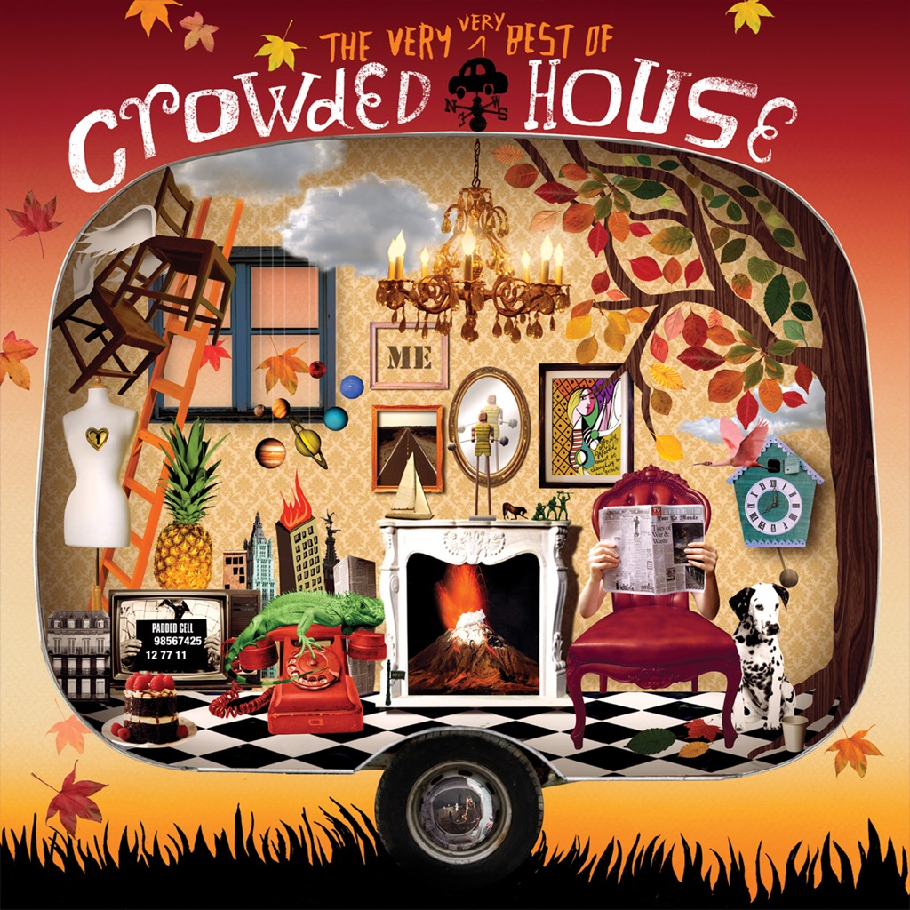

<!-- section break -->

1. World Where You Live (3:04)
2. Now We're Getting Somewhere (4:05)
3. Don't Dream It's Over (3:58)
4. Mean To Me (3:15)
5. Love You 'Til Day I Die (3:30)
6. Something So Strong (2:51)
7. Hole In The River (3:58)
8. I Walk Away (3:05)
9. Tombstone (3:30)
10. That's What I Call Love (3:37)

<!-- section break -->

## Spotify


## Videos
### Crowded House, World Where You Live
 

### More Videos

- [Crowded House - Don't Dream It's Over (Official Music Video)](https://www.youtube.com/watch?v=J9gKyRmic20)
- [Crowded House - Now We're Getting Somewhere](https://www.youtube.com/watch?v=OmnDCPWxBFM)
- [Crowded House - Something So Strong (Official Video)](https://www.youtube.com/watch?v=WyBKzBtaKWM)

## Release Information
|  Key           | Value                                                |
| ---------------| ---------------------------------------------------- |
| Release Year   | 1986                                   |
| Discogs Link   | [Crowded House - Crowded House](https://www.discogs.com/release/2035236-Crowded-House-Crowded-House) |
| Label          | Capitol Records |
| Format         | Vinyl LP Album |
| Catalog Number | EST 2016 |
| Notes | ''Hayes, Middlesex, England'' in tiny print on the backcover.  Inner sleeve with lyrics.  |