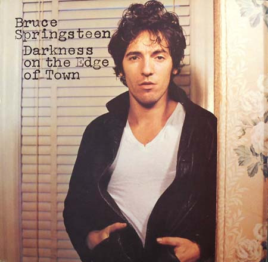

<!-- section break -->

1. Badlands (4:01)
2. Adam Raised A Cain (4:32)
3. Something In The Night (5:12)
4. Candy's Room (2:45)
5. Racing In The Street (6:52)
6. The Promised Land (4:24)
7. Factory (2:17)
8. Streets Of Fire (4:03)
9. Prove It All Night (3:57)
10. Darkness On The Edge Of Town (4:28)

<!-- section break -->

## Spotify


## Videos
### Something in the Night
 

### More Videos

- [Badlands](https://www.youtube.com/watch?v=SDlSCeQXbPo)
- [Adam Raised A Cain | Bruce Springsteen | 1978 | Darkness On The Edge Of Town | 2014 Columbia LP](https://www.youtube.com/watch?v=YTHKOHEzeMo)
- [Adam Raised a Cain](https://www.youtube.com/watch?v=PRRd78fqmIg)
- [The Promised Land | Bruce Springsteen | 1978 | Darkness On The Edge Of Town | 2014 Columbia  LP](https://www.youtube.com/watch?v=AwNGvxRzQ24)
- [Candy's Room](https://www.youtube.com/watch?v=CyPfb0vOVfo)
- [Racing in the Street](https://www.youtube.com/watch?v=cm9UuM3UXdc)
- [The Promised Land](https://www.youtube.com/watch?v=azQY2YBUMQc)
- [Factory](https://www.youtube.com/watch?v=3YuEJ_XolkM)
- [Streets of Fire](https://www.youtube.com/watch?v=HzIm7Ek6Vv0)
- [Prove It All Night](https://www.youtube.com/watch?v=UzjkWdRqWFo)
- [Darkness on the Edge of Town](https://www.youtube.com/watch?v=0LpdEyGhNxM)

## Release Information
|  Key           | Value                                                |
| ---------------| ---------------------------------------------------- |
| Release Year   | 1978                                   |
| Discogs Link   | [Bruce Springsteen - Darkness On The Edge Of Town](https://www.discogs.com/release/1856291-Bruce-Springsteen-Darkness-On-The-Edge-Of-Town) |
| Label          | CBS |
| Format         | Vinyl LP Album |
| Catalog Number | CBS 86061 |
| Notes | 'Made in England'    With picture inner sleeve and lyric insert.   |