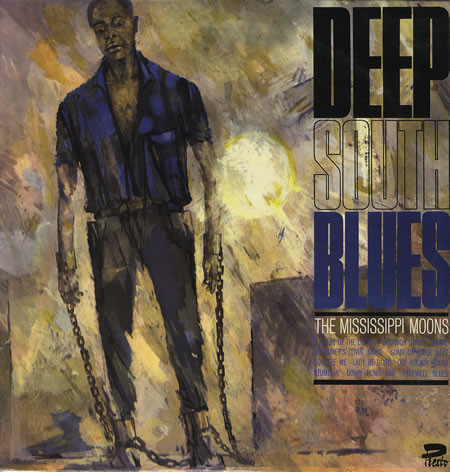

<!-- section break -->

1. Lullaby Of The Leaves
2. Bourbon Street Parade
3. My Honey's Lovin' Arms
4. Some Of These Days
5. Squeeze Me
6. Lady Be Good
7. Ole Rockin' Chair
8. Stumblin'
9. Down Home Rag
10. Farewell Blues

<!-- section break -->

## Release Information
|  Key           | Value                                                |
| ---------------| ---------------------------------------------------- |
| Release Year   | 1964                                   |
| Discogs Link   | [The Mississippi Moons - Deep South Blues](https://www.discogs.com/release/4025684-The-Mississippi-Moons-Deep-South-Blues) |
| Label          | Presto |
| Format         | Vinyl LP |
| Catalog Number | PRE 629 |
| Notes | Sleeve says PRESTO, but label on record is SAGA. Both own by manufacture. Manufactured by Allied Records Ltd. 127 Kensal Road / London W.10 |