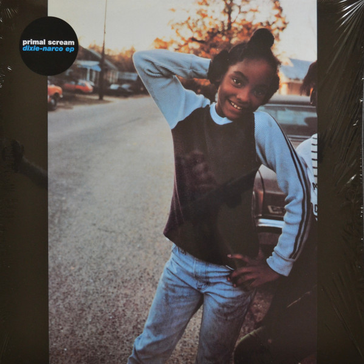

<!-- section break -->

1. Movin' On Up (3:51)
2. Stone My Soul (3:02)
3. Carry Me Home (5:16)
4. Screamadelica (10:47)

<!-- section break -->

## Release Information
|  Key           | Value                                                |
| ---------------| ---------------------------------------------------- |
| Release Year   | 2021                                   |
| Discogs Link   | [Primal Scream - Dixie-Narco EP](https://www.discogs.com/release/19110514-Primal-Scream-Dixie-Narco-EP) |
| Label          | Creation Records |
| Format         | Vinyl 12" 45 RPM EP Record Store Day Limited Edition Reissue |
| Catalog Number | 19439844431 |
| Notes | Record Store Day 2021, Drop 1 release Limited edition of 2.000 copies  The second of two hype stickers on the front reads: "record store day exclusive 180g red vinyl 4-track EP first time on vinyl since the original 1992 release  19439844431"  Contrary to the hype sticker, however, the vinyl is standard black, not red.  ℗ 2011 © 2021 Creation Records.  Made in the EU. |