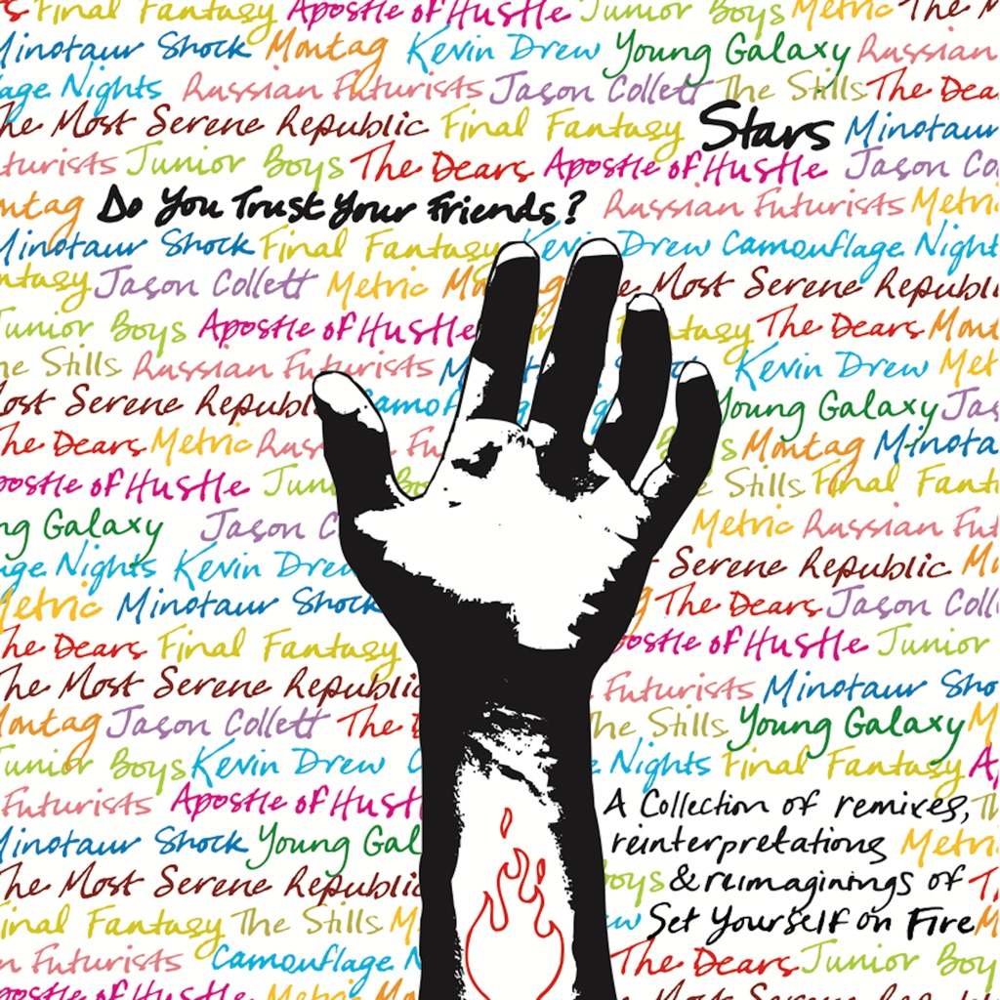

<!-- section break -->

1. Your Ex-Lover Is Dead (Final Fantasy)
2. Set Yourself On Fire (Montag)
3. Ageless Beauty (The Most Serene Republic)
4. Reunion (Jason Collett)
5. The Big Fight (Minotaur Shock)
6. What I'm Trying To Say (Parts I & II) (The Dears)
7. One More Night (Apostle Of Hustle)
8. Sleep Tonight (Junior Boys)
9. The First Five Times (The Russian Futurists)
10. He Lied About Death (Metric)
11. Celebration Guns (Camouflage Nights With Kevin Drew)
12. Soft Revolution (The Stills)
13. Calendar Girl (Young Galaxy)

<!-- section break -->

## Spotify


## Videos
### Apostle Of Hustle - One More Night (Stars Cover)
 

### More Videos

- [Jason Collett - Reunion (Stars Cover)](https://www.youtube.com/watch?v=Y-IM3LZrdrU)
- [stars - your ex-lover is dead (final fantasy remix)](https://www.youtube.com/watch?v=_WROUOOtC7U)
- [Stars- What I'm Trying to Say (The Dears)](https://www.youtube.com/watch?v=IZQXp2yn0Jg)
- [Stars - Ageless Beauty (The Most Serene Republic)](https://www.youtube.com/watch?v=rHm1tkrK1iw)
- [Stars - Set Yourself on Fire (Montag)](https://www.youtube.com/watch?v=IpSRckfN-zc)
- [Your Ex-Lover Is Dead (Final Fantasy) - Stars](https://www.youtube.com/watch?v=UeHRceDk_e8)
- [Your Ex-Lover Is Dead by Stars (another version)](https://www.youtube.com/watch?v=x4cZyF2i5yw)

## Release Information
|  Key           | Value                                                |
| ---------------| ---------------------------------------------------- |
| Release Year   | 2007                                   |
| Discogs Link   | [Stars - Do You Trust Your Friends?](https://www.discogs.com/release/1870709-Stars-Do-You-Trust-Your-Friends) |
| Label          | Arts & Crafts International |
| Format         | Vinyl 2× LP Album (Gatefold) |
| Catalog Number | ACS-024 |
| Notes | "A collection of remixes, reinterpretations & reimaginings of Set Yourself on Fire".     © 2005, 2006, 2007 & ℗ 2007 Arts&Crafts International.   Printed in Canada.  |