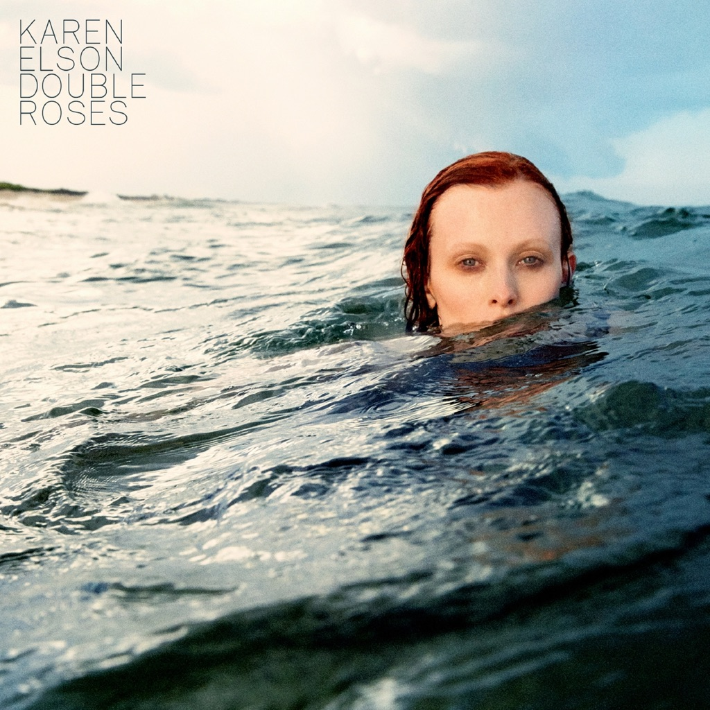

<!-- section break -->

1. Wonder Blind
2. Double Roses
3. Call Your Name
4. Hell And High Water
5. The End
6. Raven
7. Why Am I Waiting
8. A Million Stars
9. Wolf
10. Distant Shore

<!-- section break -->

## Spotify


## Videos
### Karen Elson - Double Roses [FULL ALBUM]
 

## Release Information
|  Key           | Value                                                |
| ---------------| ---------------------------------------------------- |
| Release Year   | 2017                                   |
| Discogs Link   | [Karen Elson - Double Roses](https://www.discogs.com/release/10098506-Karen-Elson-Double-Roses) |
| Label          | 1965 Records |
| Format         | Vinyl LP Album |
| Catalog Number | 9223701 |
