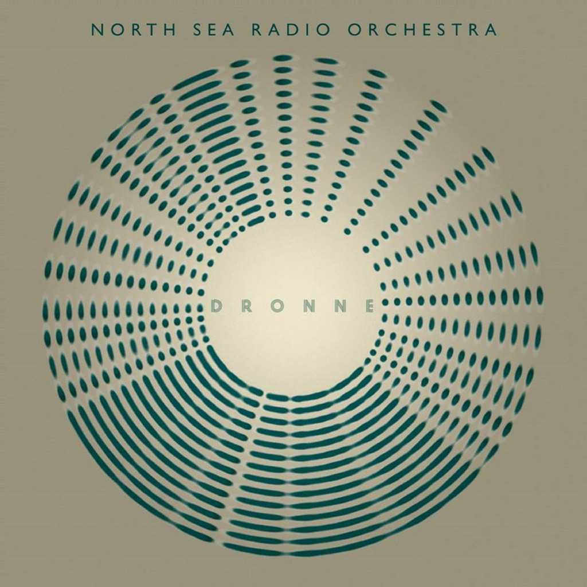

<!-- section break -->

1. Arcade
2. Vishnu Schist 
3. The British Road
4. Guitar Miniature No.4 
5. Queen Of All The Day And Night 
6. Dronne
7. Alsace Lorraine
8. Dinosaurus Rex Part 1
9. Dinosaurus Rex Part 2 

<!-- section break -->

## Spotify


## Videos
### Dinosaurus Rex, Pt. 2
 

### More Videos

- [Vishnu Schist](https://www.youtube.com/watch?v=5AC9eYK9xq0)
- [Queen of All the Day and Night](https://www.youtube.com/watch?v=xS6jpnVgx9M)
- [The British Road](https://www.youtube.com/watch?v=yafycMIV3aw)
- [Dronne](https://www.youtube.com/watch?v=nhKGhRd8wEc)
- [Alsace Lorraine](https://www.youtube.com/watch?v=HJjdqk6TV9c)

## Release Information
|  Key           | Value                                                |
| ---------------| ---------------------------------------------------- |
| Release Year   | 2016                                   |
| Discogs Link   | [North Sea Radio Orchestra - Dronne](https://www.discogs.com/release/9116811-North-Sea-Radio-Orchestra-Dronne) |
| Label          | The Household Mark |
| Format         | Vinyl LP Album |
| Catalog Number | THM004LP |
| Notes | Limited indies only 180g vinyl LP. Vinyl edition limited to 300 copies |