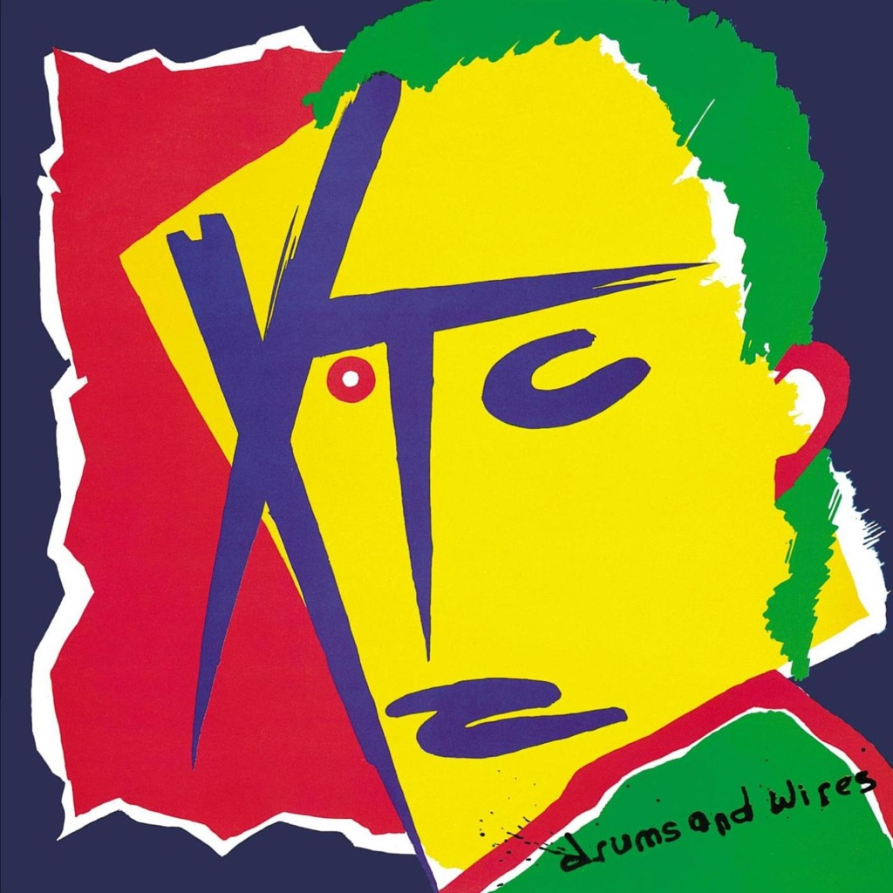

<!-- section break -->

1. Making Plans For Nigel 
2. Helicopter
3. Day In Day Out
4. When You're Near Me I Have Difficulty 
5. Ten Feet Tall
6. Roads Girdle The Globe
7. Real By Reel 
8. Millions
9. That Is The Way
10. Outside World
11. Scissor Man
12. Complicated Game 
13. Limited Edition Bonus 7"
14. Chain Of Command 
15. Limelight

<!-- section break -->

## Spotify


## Videos
### Reel By Reel (2001 Digital Remaster)
 

### More Videos

- [Making Plans For Nigel](https://www.youtube.com/watch?v=yp-WJXOb2V4)
- [XTC - Chain of Command / Limelight (1979) full 7” Single](https://www.youtube.com/watch?v=9NPMAZDUmHs)
- [When You're Near Me I Have Difficulty (2001 Digital Remaster)](https://www.youtube.com/watch?v=IKBjJl7NnJ8)
- [XTC - Drums and Wires [Full Album]](https://www.youtube.com/watch?v=N66oJVIjk2M)
- [XTC - Drums&Wires(1979)(Art-Pop)(Post-Punk)(New Wave)(Art Rock)MUST HEAR!](https://www.youtube.com/watch?v=SKRgIPbhrJk)
- [XTC - Making Plans For Nigel 1979 (Official Video) ᴴᴰ](https://www.youtube.com/watch?v=AiIlcew-GVM)
- [XTC - Complicated Game](https://www.youtube.com/watch?v=vFlq0mvTRB0)
- [Helicopter (2001 Digital Remaster)](https://www.youtube.com/watch?v=Hu4NaIC_fko)
- [Ten Feet Tall (2001 Digital Remaster)](https://www.youtube.com/watch?v=ACguqonrjI4)
- [Outside World (2001 Digital Remaster)](https://www.youtube.com/watch?v=kAKCgduec5o)
- [XTC - Drums and Wires (Full Album) [HD] Reupload](https://www.youtube.com/watch?v=ph-cxsWVrMw)

## Release Information
|  Key           | Value                                                |
| ---------------| ---------------------------------------------------- |
| Release Year   | 2020                                   |
| Discogs Link   | [XTC - Drums And Wires](https://www.discogs.com/release/16269444-XTC-Drums-And-Wires) |
| Label          | Ape House |
| Format         | Vinyl LP Album (200g), Vinyl 7" 45 RPM Single Limited Edition, All Media Reissue |
| Catalog Number | APELP103 |
| Notes | Hype Sticker on Front of Shrink Wrap Reads:  XTC drums and wires The 1979 Classic Album Newly Cut From Masters Approved by Andy Partridge.  Pressed on 200G Super-Heavyweight Vinyl LIMITED EDITION BONUS 7" LIMELIGHT / CHAIN OF COMMAND  Includes bonus 7" replicating original U.K. release, [r=585255]   Tracks not numbered on rear of sleeve - tracks listed under side one and side two   |