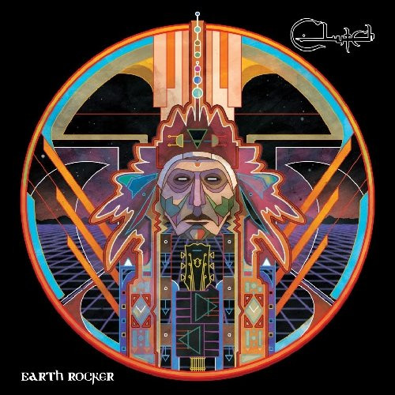

<!-- section break -->

1. Earth Rocker
2. Crucial Velocity
3. Mr. Freedom
4. D.C. Sound Attack!
5. Unto The Breach
6. Gone Cold
7. The Face
8. Book, Saddle, & Go
9. Cyborg Bette
10. Oh, Isabella
11. The Wolf Man Kindly Requests...

<!-- section break -->

## Videos
### Clutch - Earth Rocker  (Album Stream)
 

### More Videos

- [Clutch - Earth Rocker Full Album](https://www.youtube.com/watch?v=YrfZdv4PEXI)

## Release Information
|  Key           | Value                                                |
| ---------------| ---------------------------------------------------- |
| Release Year   | 2013                                   |
| Discogs Link   | [Clutch - Earth Rocker](https://www.discogs.com/release/4382663-Clutch-Earth-Rocker) |
| Label          | Weathermaker Music |
| Format         | Vinyl LP Album (Gatefold) |
| Catalog Number | WM028 |
| Notes | Gatefold sleeve.    Recorded and mixed at The Machine Shop, Belleville, NJ. MachineShopProductions.com  Mastered at Taloowa Mastering, Yonkers, New York.    Additional information at:  earthrocker.com / pro-rock.com / fb: facebook.com.clutchband / twitter:@clutchofficial    Merchandise: www.clutchmerch.com    Design & artwork: Nick Lakiotes / Twitter:@micklak    Artist management: At Isschar Entertainment, NYC / issacherentertainment.com  Legal representation: At Lommen-Abdo / Iommen.com    Weathermaker Music Management: www.weathermakermusic.com    Publishing: Jack Flanagan / Sea Gator Music (ASCAP) / ascap.com  Worldwide administrator: Jon Grant / BMG Chrysalis / bmgchrysalis.com    All songs published by Sea Gator Music (ASCAP).  All rights administered by BMG Rights Management (US) LLC.    Vinyl mastering credits obtained from information in the vinyl runout. |