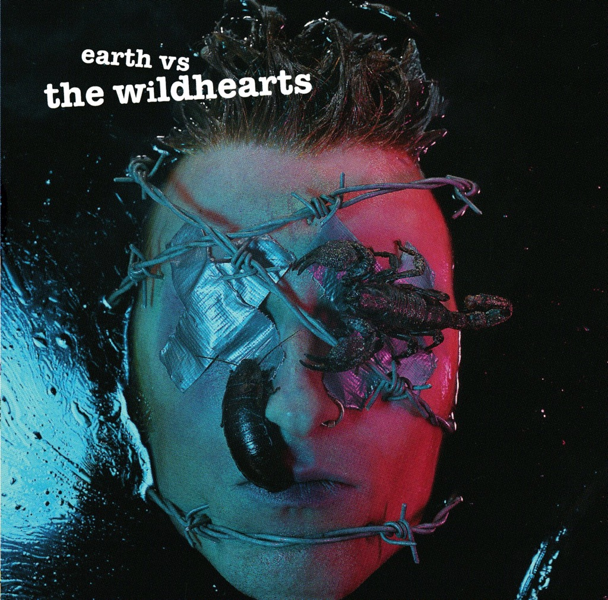

<!-- section break -->

1. Greetings From Shitsville
2. TV Tan
3. Everlone
4. Shame On Me
5. Loveshit
6. The Miles Away Girl
7. My Baby Is A Headfuck /
8. Suckerpunch
9. News Of The World
10. Love U Til I Don't

<!-- section break -->

## Videos
### The Wildhearts - Loveshit
 

### More Videos

- [The Wildhearts - TV Tan](https://www.youtube.com/watch?v=o8y-M_0UffE)
- [Greetings from Shitsville](https://www.youtube.com/watch?v=XM-iQc3yYQs)
- [News of the World](https://www.youtube.com/watch?v=L191KWeauHQ)

## Release Information
|  Key           | Value                                                |
| ---------------| ---------------------------------------------------- |
| Release Year   | 2019                                   |
| Discogs Link   | [The Wildhearts - Earth Vs The Wildhearts](https://www.discogs.com/release/14123607-The-Wildhearts-Earth-Vs-The-Wildhearts) |
| Label          | EastWest |
| Format         | Vinyl LP Album Reissue (180g) |
| Catalog Number | 0190295451950 |
| Notes | Produced by The Wildhearts at Wessex Studios, London. Engineered by KK. Additional production and mixed by Mike 'SPike' Drake at Maison Rouge Studios, London except for 'Suckerpunch' (track B3) - produced and mixed by Mark Dodson at Mayfair Studios, London.  Mastered at Sterling Sounds, NYC.  ℗ 1993 Warner Music U.K. Ltd. This release © 2019 Warner Music U.K. Ltd., a Warner Music Group company. |