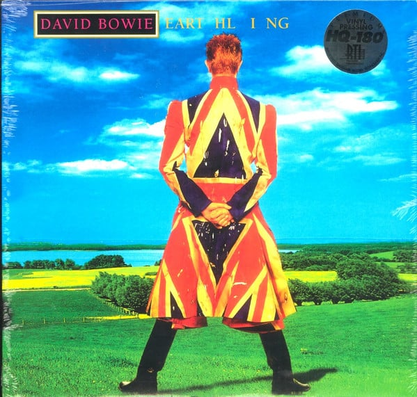

<!-- section break -->

1. Little Wonder
2. Looking For Satellites
3. Battle For Britain (The Letter)
4. Seven Years In Tibet
5. Dead Man Walking
6. Telling Lies
7. The Last Thing You Should Do
8. I'm Afraid Of Americans
9. Law (Earthlings On Fire)

<!-- section break -->

## Spotify


## Release Information
|  Key           | Value                                                |
| ---------------| ---------------------------------------------------- |
| Release Year   | 2015                                   |
| Discogs Link   | [David Bowie - Earthling](https://www.discogs.com/release/7781493-David-Bowie-Earthling) |
| Label          | ISO Records |
| Format         | Vinyl LP Album Record Store Day Reissue (Green, 180g) |
| Catalog Number | FRM-42627 |
| Notes | Black Friday Record Store Day 2015 release in Tri-fold Sleeve limited to 2000.  Recorded at Looking Glass Studios Mixed at Right Track Originally mastered at Gateway Mastering Studios Inc. Portland, Maine (Re)Mastered at Friday Music Studios, Surf City, CA & Capitol Mastering, Hollywood, CA  © 1997, 2015 ISO Records/Risky Folio, Inc. made under license to Sony Music Entertainment ℗ 1997 ISO Records/Risky Folio, Inc. made under license to Sony Music Entertainment  Title is written as "EART HL I NG" on the cover.  Premium Vinyl Pressing HQ-180 RTI   ISO/COLUMBIA STEREO/ FRIDAY MUSIC 180 GRAM AUDIOPHILE VINYL on spine  |