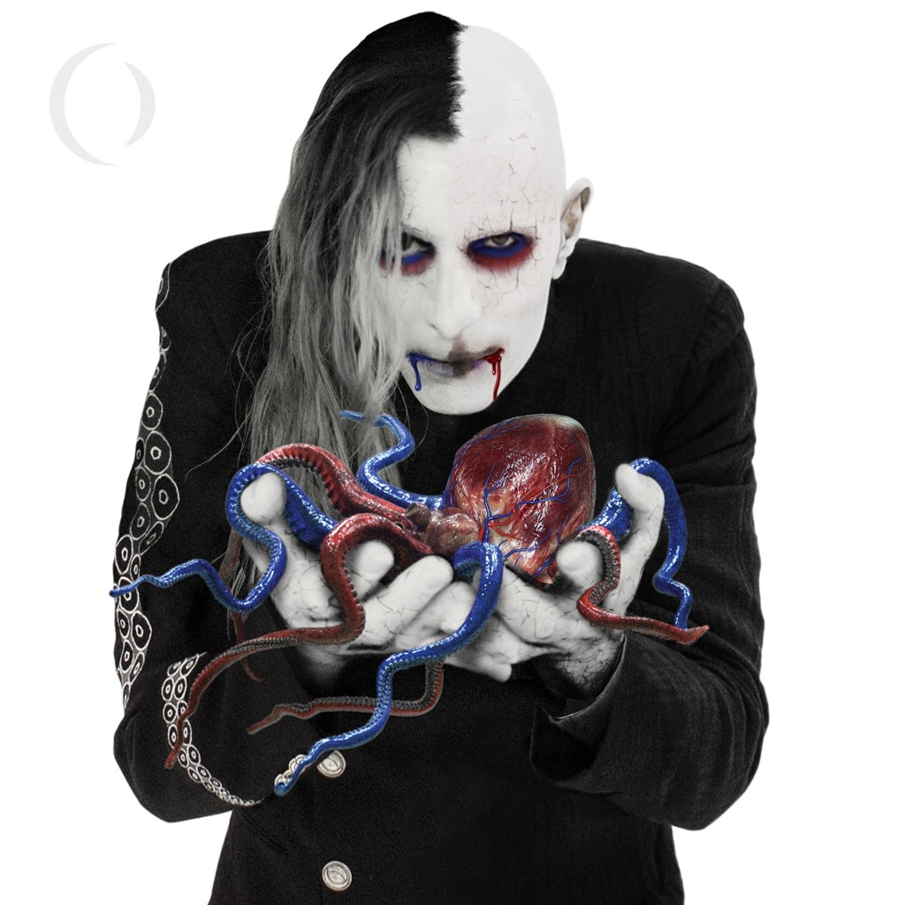

<!-- section break -->

1. Eat The Elephant
2. Disillusioned
3. The Contrarian
4. The Doomed
5. So Long, And Thanks For All The Fish
6. Talktalk
7. By And Down The River
8. Delicious
9. DLB
10. DLB
11. Hourglass
12. Feathers
13. Get The Lead Out

<!-- section break -->

## Spotify


## Videos
### A Perfect Circle - TalkTalk
 

### More Videos

- [A Perfect Circle - Eat The Elephant (2D Version of Hologram Video)](https://www.youtube.com/watch?v=mdcdxpn0JHY)
- [A Perfect Circle - So Long, And Thanks For All The Fish (Official Video)](https://www.youtube.com/watch?v=UkHSmDxX1t4)
- [A Perfect Circle - Disillusioned [Official Video]](https://www.youtube.com/watch?v=BIsH686xWl0)
- [A Perfect Circle - The Doomed [Official Video]](https://www.youtube.com/watch?v=SDvfbvuJtS8)
- [A Perfect Circle - By And Down The River [Audio]](https://www.youtube.com/watch?v=IL2N7d4WXzw)

## Release Information
|  Key           | Value                                                |
| ---------------| ---------------------------------------------------- |
| Release Year   | 2018                                   |
| Discogs Link   | [A Perfect Circle - Eat The Elephant](https://www.discogs.com/release/11861222-A-Perfect-Circle-Eat-The-Elephant) |
| Label          | BMG |
| Format         | Vinyl 2× LP Album Limited Edition (White ) |
| Catalog Number | 538374370 |
| Notes | Limited edition independent retail exclusive version of the LP on white 180 gram vinyl with alternate cover.   Tracks C3 / D1, DLB, is listed on hype sticker and labels as track 9 on both sides C and D .  It does play on both sides, but on side D, it is more of an intro / segue into "Hourglass".  Side D has a locked groove which repeats the last few seconds of “Get The Lead Out”. |