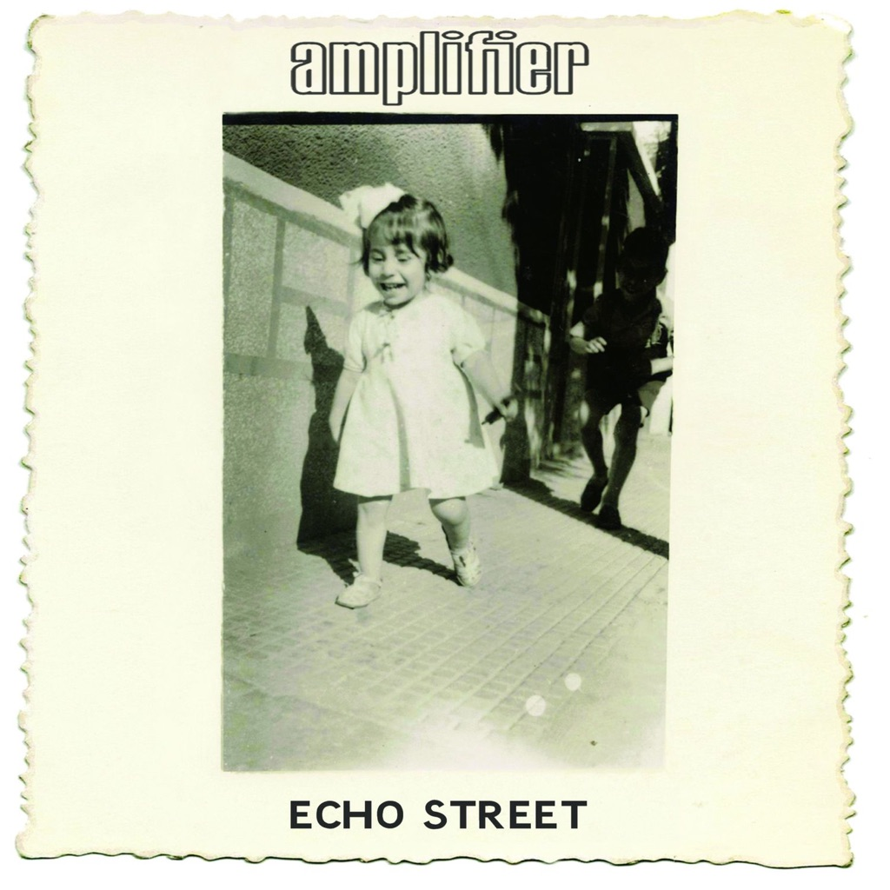

<!-- section break -->

1. Matmos
2. The Wheel
3. Extra Vehicular
4. Where The River Goes
5. Paris In The Spring
6. Between Today And Yesterday
7. Echo Street
8. Mary Rose

<!-- section break -->

## Videos
### Amplifier (Echo Street) - Where the river goes
 

## Release Information
|  Key           | Value                                                |
| ---------------| ---------------------------------------------------- |
| Release Year   | 2013                                   |
| Discogs Link   | [Amplifier - Echo Street](https://www.discogs.com/release/4379512-Amplifier-Echo-Street) |
| Label          | Kscope |
| Format         | Vinyl 2× LP Album (180 g) |
| Catalog Number | KSCOPE837 |
| Notes | Comes in gatefold sleeve with full color inner sleeves.     Copies preordered from the Ampcorp Industries web store come signed by all four band members.    Copies ordered from Burning Shed include a download card.    ℗ & © 2013 Ampcorp Industries  Kscope is a Snapper Music label  www.kscopemusic.com  www.amplifierband.com  www.ampcorp-industries.com    Cat# appears as KSCOPE837 on spine, but on both labels it appears wrongly as KSCOPE835   (which is the cat# for "Steven Wilson - The Raven That Refused To Sing"). |