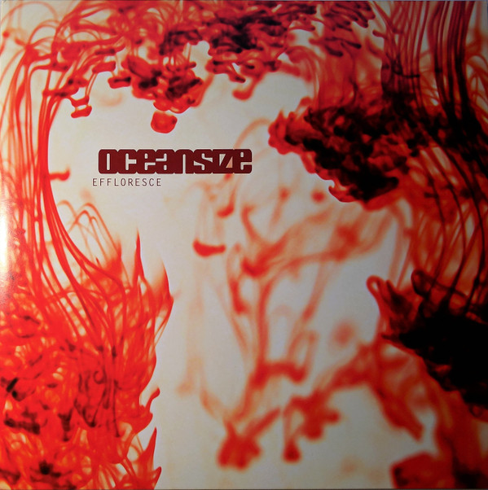

<!-- section break -->

1. I Am The Morning
2. Catalyst
3. One Day All This Could Be Yours
4. Massive Bereavement
5. Rinsed
6. You Wish
7. Remember Where You Are
8. Amputee
9. Unravel
10. Women Who Love Men Who Love Drugs
11. Saturday Morning Breakfast Show
12. Long Forgotten

<!-- section break -->

## Spotify


## Videos
### Oceansize - One Day All This Could Be Yours
 

### More Videos

- [Oceansize - Catalyst](https://www.youtube.com/watch?v=tkNSLFb1e-I)

## Release Information
|  Key           | Value                                                |
| ---------------| ---------------------------------------------------- |
| Release Year   | 2017                                   |
| Discogs Link   | [Oceansize - Effloresce](https://www.discogs.com/release/11077284-Oceansize-Effloresce) |
| Label          | Beggars Banquet |
| Format         | Vinyl 2× LP Album Reissue Remastered (Yellow/Red Swirl) |
| Catalog Number | BBQLP 235X |
| Notes | 2017 reissue by Beggars Banquet on red/yellow swirl vinyl.  Comes with a download voucher.  "Unravel" features a sample from Maurice Ravel's "Gaspard De La Nuit" by Sarah Cahill.  |