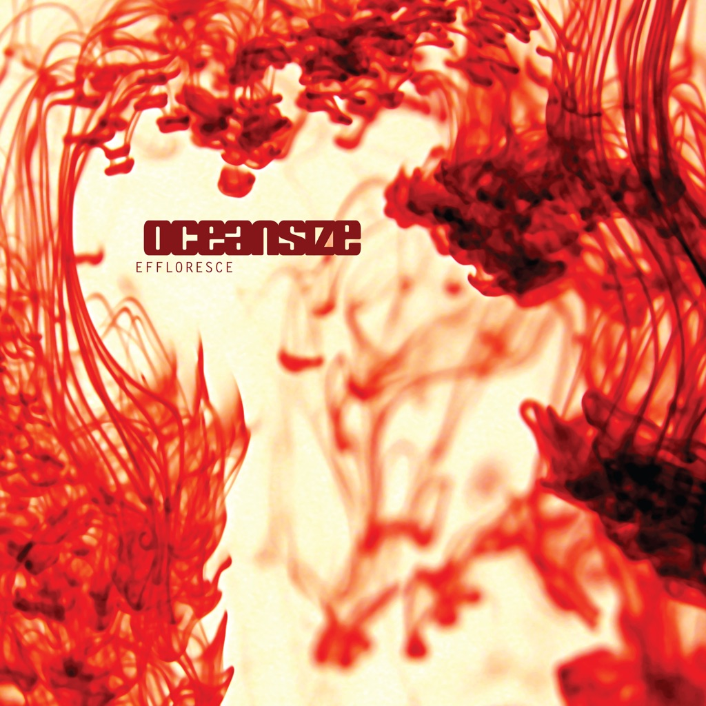

<!-- section break -->

1. I Am The Morning (4:18)
2. Catalyst (6:40)
3. One Day All This Could Be Yours (4:19)
4. Massive Bereavement (9:59)
5. Rinsed (3:58)
6. You Wish (6:00)
7. Remember Where You Are (5:22)
8. Amputee (5:32)
9. Unravel (2:50)
10. Women Who Love Men Who Love Drugs (8:30)
11. Saturday Morning Breakfast Show (9:04)
12. Long Forgotten (8:57)

<!-- section break -->

## Spotify


## Videos
### Oceansize - One Day All This Could Be Yours
 

### More Videos

- [Oceansize - Catalyst](https://www.youtube.com/watch?v=tkNSLFb1e-I)

## Release Information
|  Key           | Value                                                |
| ---------------| ---------------------------------------------------- |
| Release Year   | 2003                                   |
| Discogs Link   | [Oceansize - Effloresce](https://www.discogs.com/release/1460913-Oceansize-Effloresce) |
| Label          | Beggars Banquet |
| Format         | Vinyl 2× LP Album |
| Catalog Number | BBQ 235 |
| Notes | Mastered at Abbey Road Studios.    "Unravel" features a sample from Maurice Ravel's "Gaspard De La Nuit" by Sarah Cahill.  |