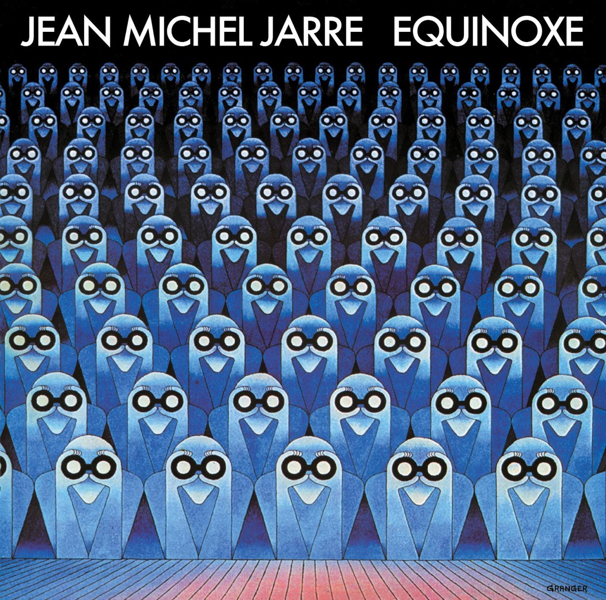

<!-- section break -->

1. Equinoxe Part 1 (2:23)
2. Equinoxe Part 2 (5:02)
3. Equinoxe Part 3 (4:59)
4. Equinoxe Part 4 (7:04)
5. Equinoxe Part 5 (3:52)
6. Equinoxe Part 6 (2:47)
7. Equinoxe Part 7 (7:48)
8. Equinoxe Part 8 (5:07)

<!-- section break -->

## Spotify


## Videos
### Equinoxe, Pt. 5
 

### More Videos

- [Jean Michel Jarre - Equinoxe Full Album (MFSL) [HQ]](https://www.youtube.com/watch?v=RAhgz9aLukk)
- [Equinoxe, Pt. 1](https://www.youtube.com/watch?v=kAcUmjU-ZDo)
- [Equinoxe, Pt. 2](https://www.youtube.com/watch?v=_okeeslfmh8)
- [Equinoxe, Pt. 3](https://www.youtube.com/watch?v=lzcPAAaeAF8)
- [Equinoxe, Pt. 4](https://www.youtube.com/watch?v=W18VtbMEbZ0)
- [Equinoxe, Pt. 7](https://www.youtube.com/watch?v=IuJ50xs2rWU)
- [Equinoxe, Pt. 6](https://www.youtube.com/watch?v=eeAfE-s2Ow8)
- [Equinoxe, Pt. 8](https://www.youtube.com/watch?v=W4Te8E3AHQU)

## Release Information
|  Key           | Value                                                |
| ---------------| ---------------------------------------------------- |
| Release Year   | 2015                                   |
| Discogs Link   | [Jean-Michel Jarre - Equinoxe](https://www.discogs.com/release/7597791-Jean-Michel-Jarre-Equinoxe) |
| Label          | Disques Dreyfus |
| Format         | Vinyl LP Album Reissue Remastered (180 Gram) |
| Catalog Number | 88843024691 |
| Notes | Cover & labels: ℗ 1978 Disques Dreyfus-BMG © 2015 Disques Dreyfus-BMG  Made in the EU.  Cover: Recorded on MCI-STUDIO EQUIPMENT New mastering from the original analog tapes 2014 Special thanks to [a=Michel Geiss]  |