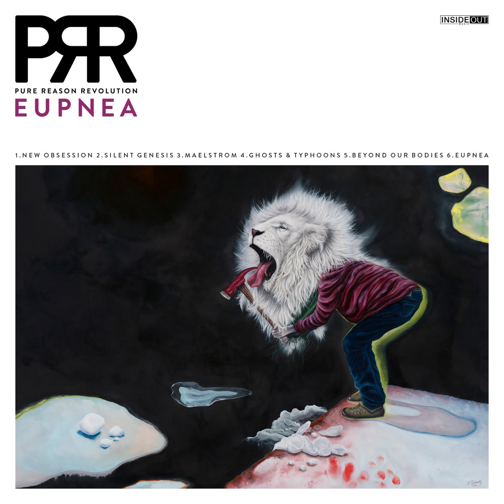

<!-- section break -->

1. New Obsession
2. Silent Genesis
3. Maelstrom
4. Ghosts & Typhoons
5. Beyond Our Bodies
6. Eupnea
7. New Obsession (5:07)
8. Silent Genesis (10:20)
9. Maelstrom (5:44)
10. Ghosts & Typhoons (8:45)
11. Beyond Our Bodies (4:28)
12. Eupnea (13:22)

<!-- section break -->

## Spotify


## Videos
### PURE REASON REVOLUTION - Ghosts & Typhoons (OFFICIAL VIDEO)
 

## Release Information
|  Key           | Value                                                |
| ---------------| ---------------------------------------------------- |
| Release Year   | 2020                                   |
| Discogs Link   | [Pure Reason Revolution - Eupnea](https://www.discogs.com/release/15061317-Pure-Reason-Revolution-Eupnea) |
| Label          | Inside Out Music |
| Format         | Vinyl LP (Yellow Neon, 180 Gram), Vinyl LP Single Sided Etched (Yellow Neon, 180 Gram), All Media Album, CD Album, All Media Limited Edition |
| Catalog Number | IOMLP 545 |
| Notes | Gatefold release and limited to 100 copies from the Burning Shed online store.  CD housed in a transparent sleeve. Included a 12" lyric sheet.  Made in the EU.  |