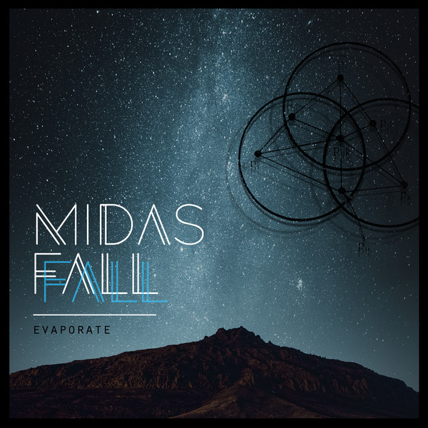

<!-- section break -->

1. Bruise Pusher (3:57)
2. Evaporate (5:38)
3. Soveraine (5:46)
4. Glue (3:53)
5. Sword To Shield (4:00)
6. Dust And Bone (4:01)
7. Awake (2:13)
8. In Sunny Landscapes (5:28)
9. Lapsing (4:09)
10. Howling At The Clouds (4:24)

<!-- section break -->

## Spotify


## Videos
### Midas Fall - Evaporate (Live Session)
 

### More Videos

- [Midas Fall - Glue](https://www.youtube.com/watch?v=oZ_ArHLW43I)
- [Midas Fall - Evaporate](https://www.youtube.com/watch?v=k0BnZ_rO-R4)

## Release Information
|  Key           | Value                                                |
| ---------------| ---------------------------------------------------- |
| Release Year   | 2018                                   |
| Discogs Link   | [Midas Fall - Evaporate](https://www.discogs.com/release/11947803-Midas-Fall-Evaporate) |
| Label          | Monotreme Records |
| Format         | Vinyl LP |
| Catalog Number | MONO-130VNL |
| Notes | Limited to 500 copies on 180g vinyl (300 clear blue & black, 200 black) Colours were randomly distributed Includes CD of the Album in Card Sleeve |