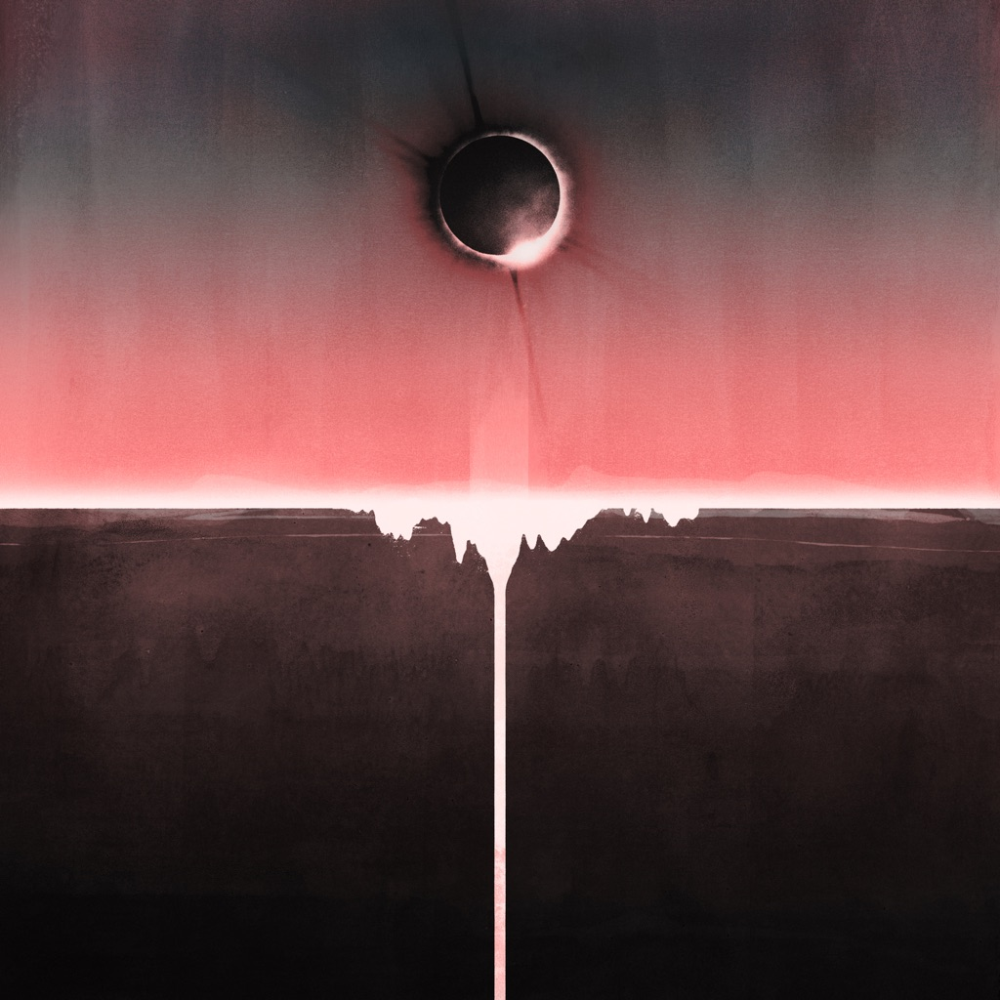

<!-- section break -->

1. Coolverine (6:15)
2. Party In The Dark (4:02)
3. Brain Sweeties (4:43)
4. Crossing The Road Material (6:58)
5. aka 47 (4:16)
6. 20 Size (4:41)
7. 1000 Foot Face (4:31)
8. Don't Believe The Fife (6:23)
9. Battered At A Scramble (4:02)
10. Old Poisons (4:29)
11. Every Country's Sun (5:35)
12. 20 Size (4:20)
13. 1000 Foot Face (4:53)
14. Don't Believe The Fife (6:10)
15. Battered At A Scramble (4:19)
16. Old Poisons (4:35)
17. Every Country's Sun (5:32)
18. Coolverine (6:17)
19. Party In The Dark (4:02)
20. Brain Sweeties (4:44)
21. Crossing The Road Material (6:58)
22. aka 47 (4:16)
23. 20 Size (4:44)
24. 1000 Foot Face (4:31)
25. Don't Believe The Fife (6:24)
26. Battered At A Scramble (4:03)
27. Old Poisons (4:30)
28. Every Country's Sun (5:37)

<!-- section break -->

## Spotify


## Videos
### Every Country's Sun
 

## Release Information
|  Key           | Value                                                |
| ---------------| ---------------------------------------------------- |
| Release Year   | 2017                                   |
| Discogs Link   | [Mogwai - Every Country's Sun](https://www.discogs.com/release/10769899-Mogwai-Every-Countrys-Sun) |
| Label          | Rock Action Records |
| Format         | Vinyl 2× LP Album (White), Vinyl 12" 33 ⅓ RPM, CD Album, Box Set Album Deluxe Edition |
| Catalog Number | ROCKACT108 |
| Notes | Boxset includes: - white vinyl double LP in a gatefold sleeve - 12" with demos in own sleeve - seven 12"x12" photo prints - a copy of the UK/Europe CD ([r=10788412]) - a download coupon  Copies bought direct from the Mogwai webshop came with a 12"x12" graphical print, hand signed by the band members. This was included as an additional item, separate from the sealed box.  CD-Track durations are taken from the cd-ripper programm. |