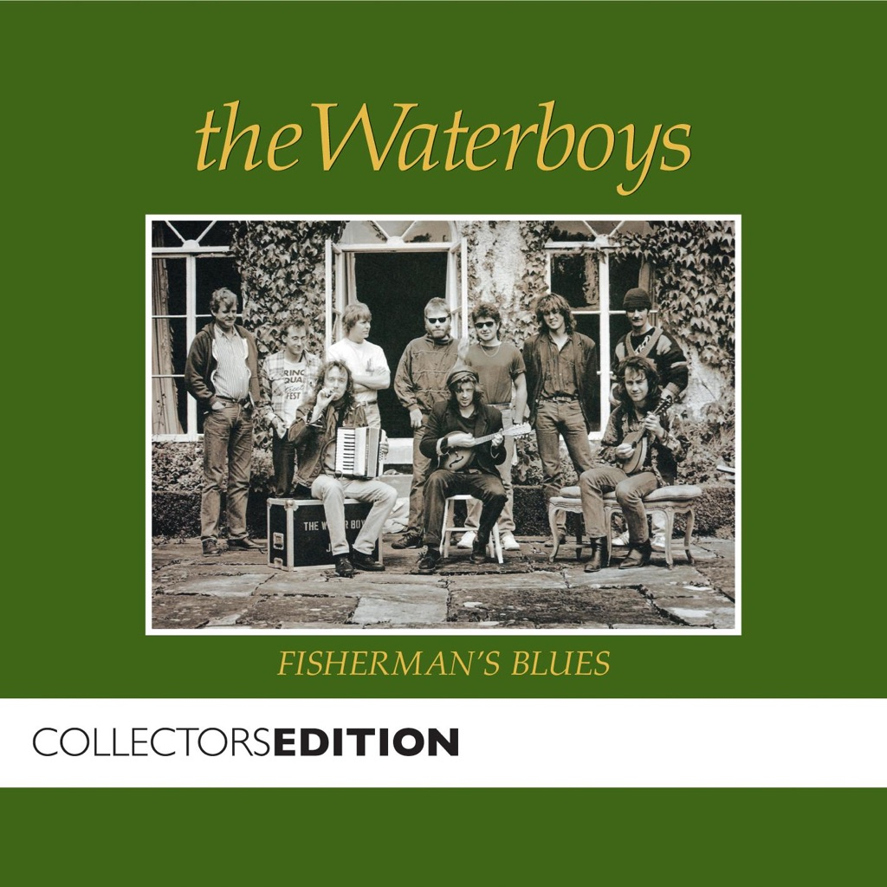

<!-- section break -->

1. Fisherman's Blues
2. We Will Not Be Lovers
3. Strange Boat
4. World Party
5. Sweet Thing
6. And A Bang On The Ear
7. Has Anybody Here Seen Hank?
8. When Will We Be Married?
9. When Ye Go Away
10. Dunford’s Fancy
11. The Stolen Child

<!-- section break -->

## Spotify


## Release Information
|  Key           | Value                                                |
| ---------------| ---------------------------------------------------- |
| Release Year   | 2015                                   |
| Discogs Link   | [The Waterboys - Fisherman's Blues](https://www.discogs.com/release/7147495-The-Waterboys-Fishermans-Blues) |
| Label          | Chrysalis |
| Format         | Vinyl LP Album Reissue (180g) |
| Catalog Number | CHEN 5 |
| Notes | www.mikescottwaterboys.com  Made in the E.U.  Track B5 not listed on rear sleeve. Listed on label and printed inner sleeve.  Track B6 contains a coda of “This Land Is Your Land” that is not credited on sleeve, but is partially acknowledged on the label and inner sleeve.  |