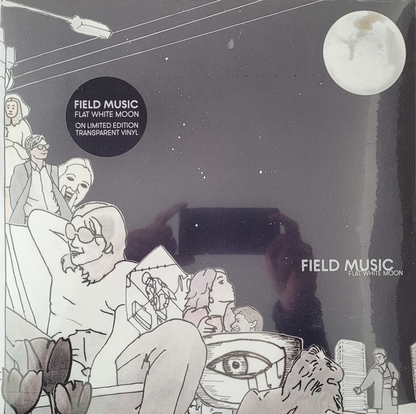

<!-- section break -->

1. Orion From The Street
2. Do Me A Favour
3. Not When You're In Love
4. Out Of The Frame
5. When You Last Heard From Linda
6. No Pressure
7. In This City
8. I'm The One Who Wants To Be With You
9. Meant To Be
10. Invisible Days
11. The Curtained Room
12. You Get Better

<!-- section break -->

## Spotify


## Videos
### Field Music - Not When You're In Love (Official Video)
 

### More Videos

- [Field Music - Flat White Moon (Full Album) 2021](https://www.youtube.com/watch?v=YfdqxwgyFgY)
- [Field Music - Flat White Moon](https://www.youtube.com/watch?v=DlP8QWJtV04)

## Release Information
|  Key           | Value                                                |
| ---------------| ---------------------------------------------------- |
| Release Year   | 2021                                   |
| Discogs Link   | [Field Music - Flat White Moon](https://www.discogs.com/release/18420103-Field-Music-Flat-White-Moon) |
| Label          | Memphis Industries |
| Format         | Vinyl LP Album Limited Edition (Transparent) |
| Catalog Number | MI0657LP |
