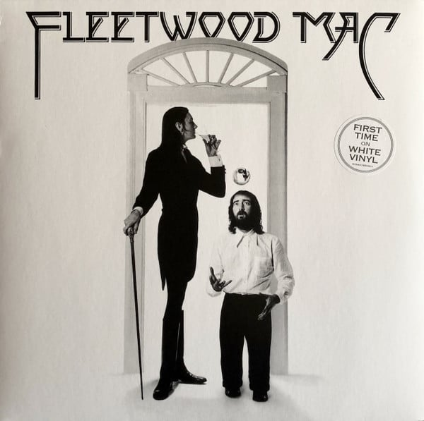

<!-- section break -->

1. Monday Morning (2:48)
2. Warm Ways (3:50)
3. Blue Letter (2:31)
4. Rhiannon (4:12)
5. Over My Head (3:34)
6. Crystal (5:12)
7. Say You Love Me (4:11)
8. Landslide (3:05)
9. World Turning (4:25)
10. Sugar Daddy (4:09)
11. I'm So Afraid (4:15)

<!-- section break -->

## Spotify


## Videos
### Fleetwood Mac - Fleetwood Mac (Full Album) [1975]
 

## Release Information
|  Key           | Value                                                |
| ---------------| ---------------------------------------------------- |
| Release Year   | 2019                                   |
| Discogs Link   | [Fleetwood Mac - Fleetwood Mac](https://www.discogs.com/release/14471238-Fleetwood-Mac-Fleetwood-Mac) |
| Label          | Reprise Records |
| Format         | Vinyl LP Album Reissue Stereo (White) |
| Catalog Number | RCV1 2281 |
| Notes | Reissue on white vinyl. ℗ & © 1975 Warner Records Inc. Made in the E.U.  The sticker on the sleeve states "first time on white vinyl" when this isn't the case - it had previously been issued on white vinyl in the UK in 1978 [r2547373].    . |