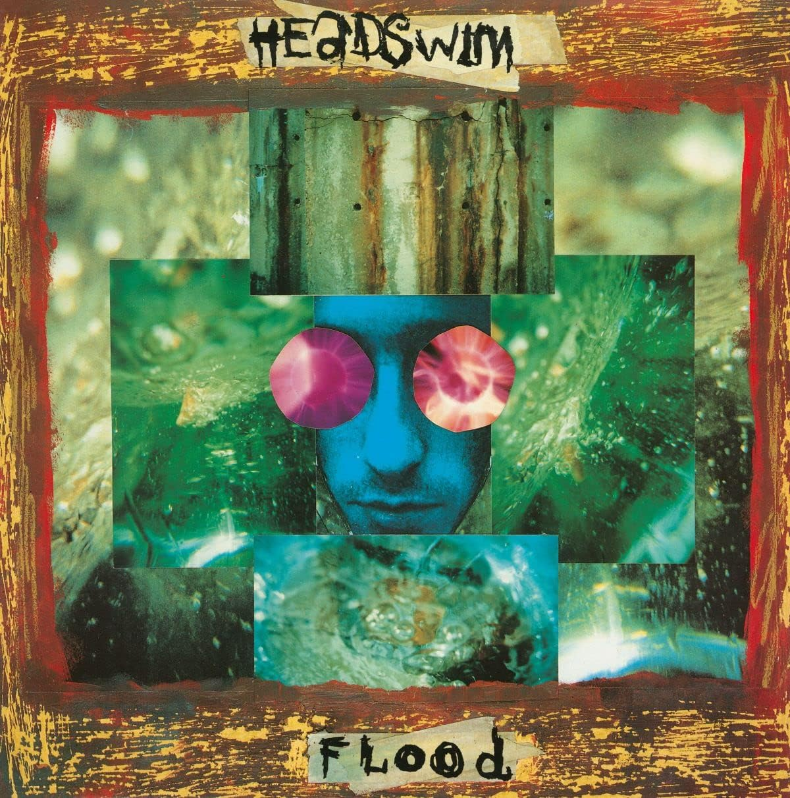

<!-- section break -->

1. Gone To Pot
2. Soup
3. Try Disappointed
4. Crawl
5. Dead
6. Years On Me
7. Apple Of My Eye
8. Down
9. Stinkhorn
10. Safe Harvest
11. Beneath A Black Moon
12. Rolling Intro
13. Gone To Pot (BBC R1 Rock Show)
14. Stinkhorn (BBC R1 Rock Show)
15. Try Disappointed (BBC R1 Rock Show)
16. Beneath A Black Moon (BBC R1 Rock Show)
17. The Fear
18. Apprenticed To Pain
19. Morning Song
20. Rotting Tooth
21. Proud
22. Precipity Flood

<!-- section break -->

## Videos
### Headswim - Gone To Pot (HQ)
 

### More Videos

- [Headswim - Stinkhorn (HQ)](https://www.youtube.com/watch?v=ZivlvKrZsFQ)

## Release Information
|  Key           | Value                                                |
| ---------------| ---------------------------------------------------- |
| Release Year   | 2022                                   |
| Discogs Link   | [Headswim - Flood](https://www.discogs.com/release/24727973-Headswim-Flood) |
| Label          | Epic |
| Format         | Vinyl LP Album Reissue, Vinyl LP (Yellow) |
| Catalog Number | TAR055V |
| Notes | 2022 reissue (black vinyl) with second vinyl (yellow) in gatefold sleeve with additional notes |