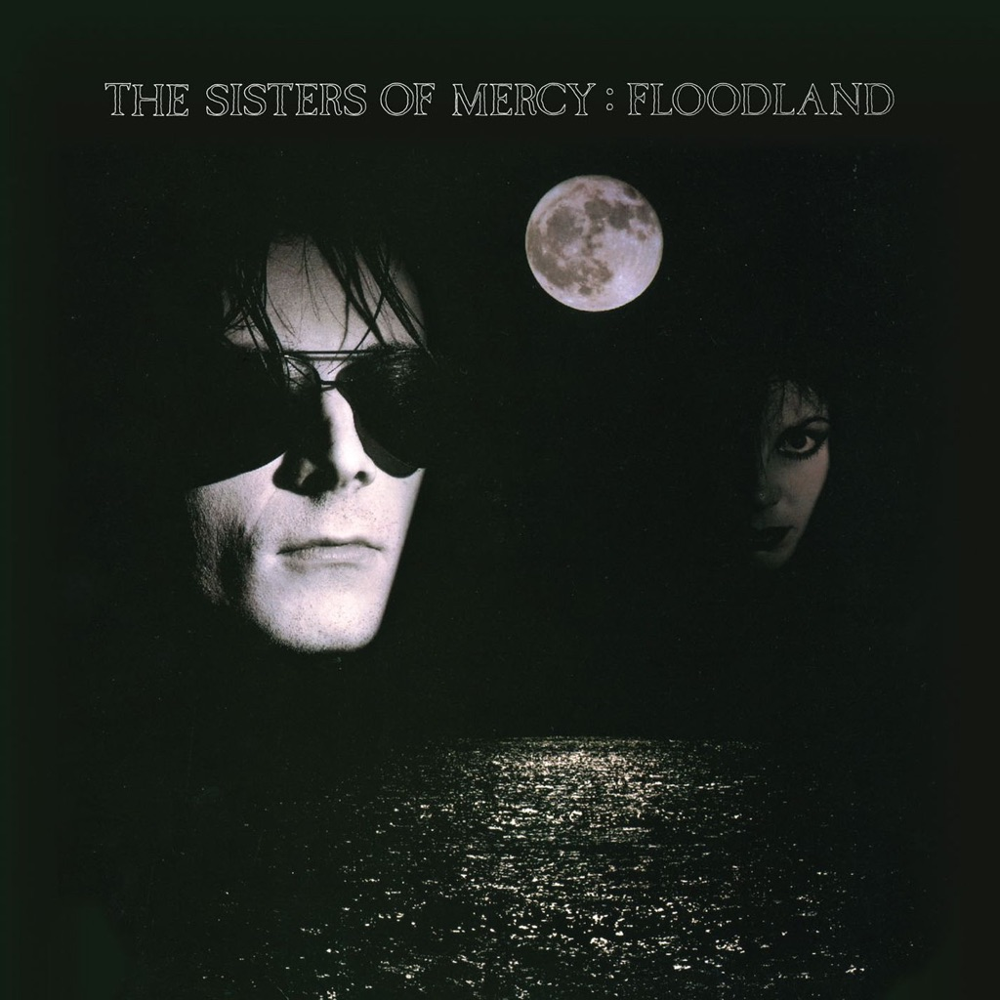

<!-- section break -->

1. Floodland
2. Dominion/Mother Russia (7:00)
3. Flood I (6:23)
4. Lucretia My Reflection (4:57)
5. 1959 (4:14)
6. This Corrosion (9:31)
7. Flood II (6:14)
8. Driven Like The Snow (4:38)
9. Never Land (A Fragment) (3:00)
10. This Corrosion
11. This Corrosion (8:37)
12. Torch (3:50)
13. Colours (7:13)
14. Dominion
15. Dominion (5:08)
16. Untitled (3:36)
17. Sandstorm (1:49)
18. Emma (6:16)
19. Lucretia My Reflection
20. Lucretia My Reflection (9:52)
21. Long Train (1984) (7:28)

<!-- section break -->

## Videos
### Driven Like the Snow (Vinyl Version) (New Version for Digital)
 

### More Videos

- [Flood I (New Version for Digital)](https://www.youtube.com/watch?v=Pekj1Y4raSM)
- [1959 (New Version for Digital)](https://www.youtube.com/watch?v=EWOQWsvQB-k)
- [Flood II (Vinyl Version) (New Version for Digital)](https://www.youtube.com/watch?v=AMbsclRxsjk)
- [Never Land (A Fragment) (New Version for Digital)](https://www.youtube.com/watch?v=EjVZBS9C5Gw)
- [Torch (New Version for Digital)](https://www.youtube.com/watch?v=8rUXffWx2mE)
- [Colours (New Version for Digital)](https://www.youtube.com/watch?v=PpVHw2ehZa0)
- [Untitled (New Version for Digital)](https://www.youtube.com/watch?v=lQ87rfkvAes)
- [Sandstorm (New Version for Digital)](https://www.youtube.com/watch?v=XckmFiSXi9Y)
- [Emma (New Version for Digital)](https://www.youtube.com/watch?v=JPNF7W3q9fk)
- [Long Train (1984) (New Version for Digital)](https://www.youtube.com/watch?v=K-pR4KvDnc8)

## Release Information
|  Key           | Value                                                |
| ---------------| ---------------------------------------------------- |
| Release Year   | 2015                                   |
| Discogs Link   | [The Sisters Of Mercy - Floodland](https://www.discogs.com/release/7789057-The-Sisters-Of-Mercy-Floodland) |
| Label          | Warner Music Group |
| Format         | Vinyl LP Album Reissue, Vinyl 3× 12" 45 RPM EP Reissue, Box Set |
| Catalog Number | 0825646077038 |
| Notes | LP has lyric sheet / poster included, emulating original release.  All three 12" EPs, as well as being housed in their own (heavier-than-the-original) card sleeves, have black poly-lined inner sleeves.  There are anomalies with all but the Side G & H runouts: The usual [l430654] vinyl runout scheme includes 'E' as the format identifier for stereo, 12", 33⅓ RPM, and 'M' for stereo, 12", 45 RPM. However, on this release, the format identifier for Sides A & B is 'M', despite the fact that they play at 33⅓ RPM, and that for Sides C, D, E & F is 'E', despite them playing at 45 RPM. |