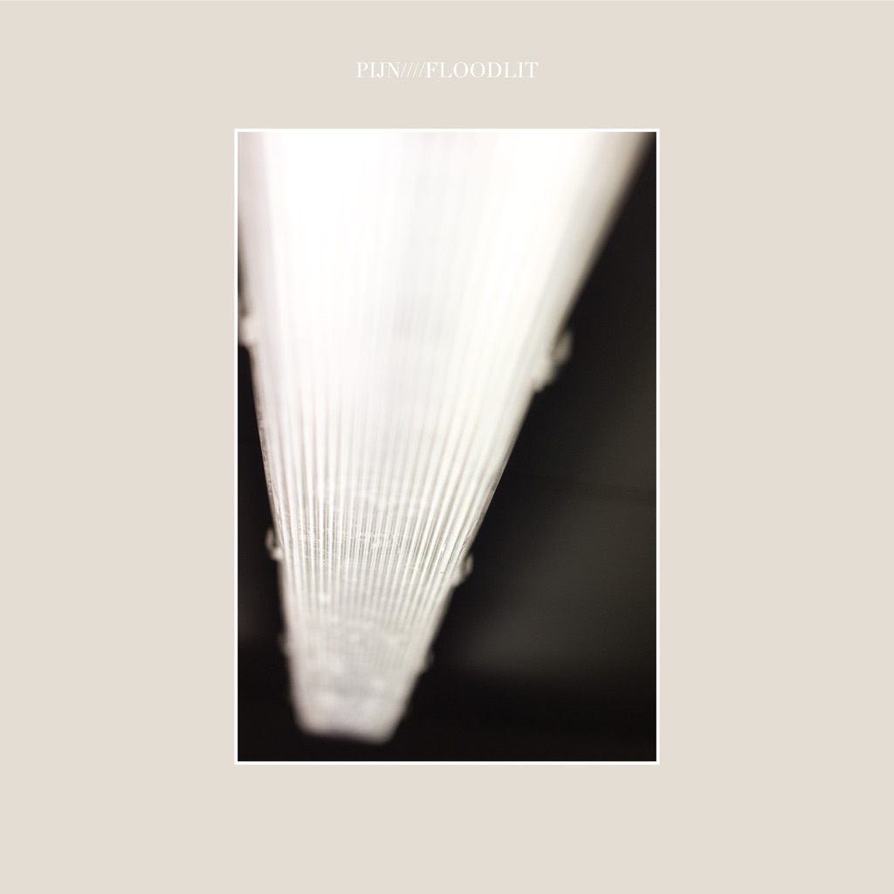

<!-- section break -->

1. Dumbstruck & Floodlit (8:23)
2. Hazel (2:29)
3. Cassandra (1:37)
4. Lacquer (7:25)

<!-- section break -->

## Spotify


## Videos
### Pijn - Floodlit (Full EP)
 

### More Videos

- [Pijn - Dumbstruck & Floodlit Live](https://www.youtube.com/watch?v=F417DTW7O6o)

## Release Information
|  Key           | Value                                                |
| ---------------| ---------------------------------------------------- |
| Release Year   | 2017                                   |
| Discogs Link   | [Pijn - Floodlit](https://www.discogs.com/release/10611482-Pijn-Floodlit) |
| Label          | Holy Roar Records |
| Format         | Vinyl LP 45 RPM EP Limited Edition Repress (Cream) |
| Catalog Number | HRR166 |
| Notes | Repress, Edition of 250.  Durations taken from digital files.  |