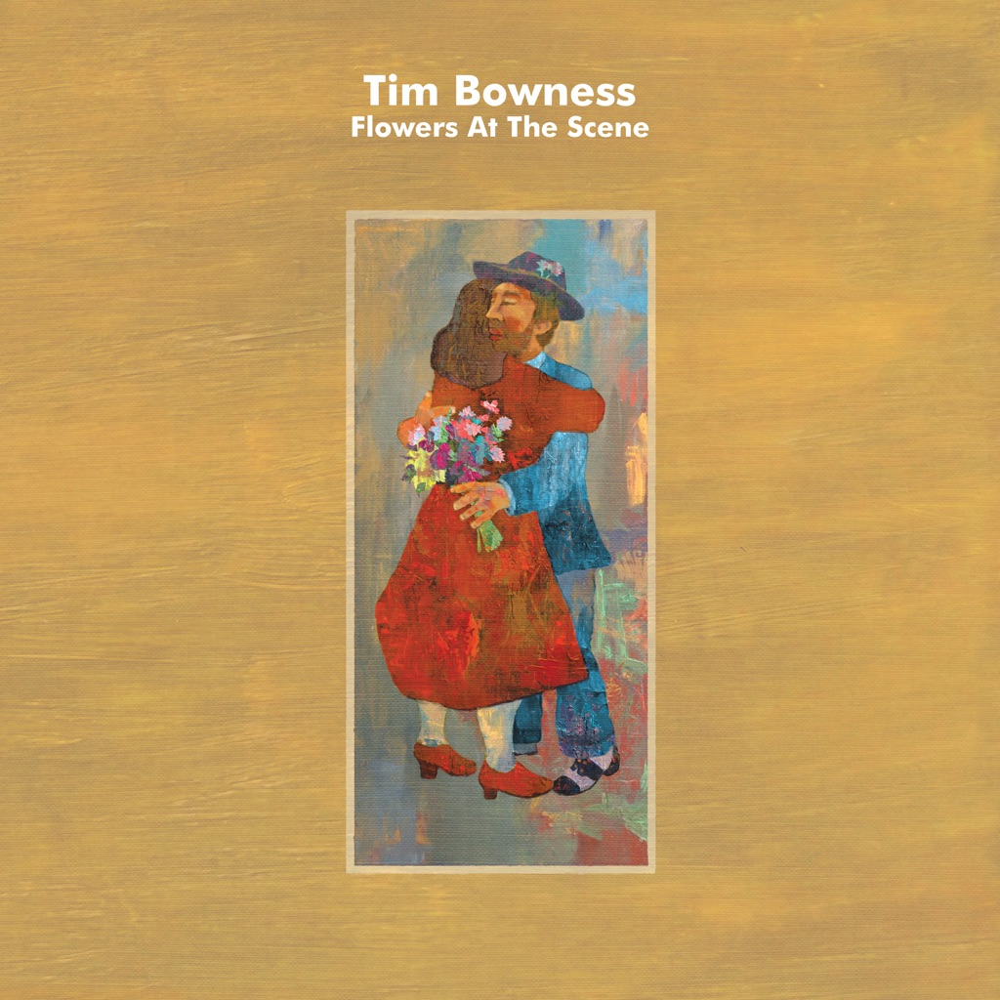

<!-- section break -->

1. I Go Deeper (4:15)
2. The Train That Pulled Away (4:04)
3. Rainmark (4:15)
4. Not Married Anymore (3:30)
5. Flowers At The Scene (3:04)
6. It's The World (3:03)
7. Borderline (3:45)
8. Ghostlike (5:08)
9. The War On Me (3:47)
10. Killing To Survive (3:59)
11. What Lies Here (4:00)
12. I Go Deeper (4:15)
13. The Train That Pulled Away (4:04)
14. Rainmark (4:15)
15. Not Married Anymore (3:30)
16. Flowers At The Scene (3:04)
17. It's The World (3:03)
18. Borderline (3:45)
19. Ghostlike (5:08)
20. The War On Me (3:47)
21. Killing To Survive (3:59)
22. What Lies Here (4:00)

<!-- section break -->

## Spotify


## Videos
### TIM BOWNESS - I Go Deeper (Lyric Video)
 

### More Videos

- [TIM BOWNESS - Borderline (Lyric Video)](https://www.youtube.com/watch?v=qDuOJWLXM28)
- [TIM BOWNESS - It's The World (Lyric Video)](https://www.youtube.com/watch?v=ohSYbX4qHzc)
- [TIM BOWNESS talks “Flowers At The Scene” - Part 1](https://www.youtube.com/watch?v=ZuZ4o2Apr7o)

## Release Information
|  Key           | Value                                                |
| ---------------| ---------------------------------------------------- |
| Release Year   | 2019                                   |
| Discogs Link   | [Tim Bowness - Flowers At The Scene](https://www.discogs.com/release/13283408-Tim-Bowness-Flowers-At-The-Scene) |
| Label          | Inside Out Music |
| Format         | Vinyl LP Album (Red Transparent), CD Album, All Media Limited Edition Numbered |
| Catalog Number | IOMLP 524 |
| Notes | Limited to 500 copies. Signed and numbered by Tim Bowness.  Includes free CD of entire album, lyric insert, and a signed greetings card. |