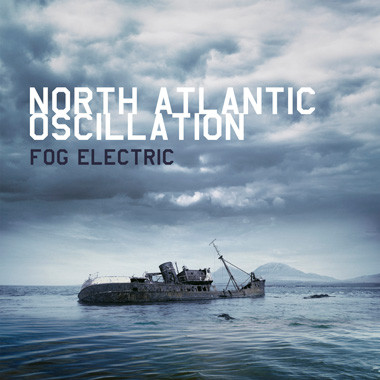

<!-- section break -->

1. Soft Coda (4:20)
2. Chirality (4:04)
3. Mirador (4:36)
4. Interval (4:04)
5. Empire Waste (5:45)
6. Savage With Barometer (5:32)
7. Expert With Altimeter (5:16)
8. The Receiver (5:57)
9. Downhill (3:54)

<!-- section break -->

## Spotify


## Videos
### North Atlantic Oscillation - Savage with Barometer (Fog Electric)
 

### More Videos

- [North Atlantic Oscillation - Soft Coda](https://www.youtube.com/watch?v=M43P_8UkA5A)
- [North Atlantic Oscillation - Chirality (from Fog Electric)](https://www.youtube.com/watch?v=jMPe7pdj6Kw)
- [North Atlantic Oscillation - The Receiver](https://www.youtube.com/watch?v=lddEcLhINGA)

## Release Information
|  Key           | Value                                                |
| ---------------| ---------------------------------------------------- |
| Release Year   | 2012                                   |
| Discogs Link   | [North Atlantic Oscillation - Fog Electric](https://www.discogs.com/release/3836810-North-Atlantic-Oscillation-Fog-Electric) |
| Label          | Kscope |
| Format         | Vinyl LP Album |
| Catalog Number | KSCOPE828 |
| Notes | First 500 preorders received a 7" with this LP. Last track "Theory Of Tides" is not included on the LP version. Includes download code.  |