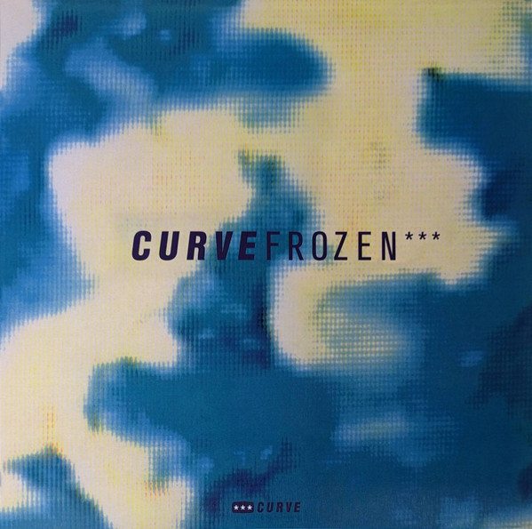

<!-- section break -->

1. Coast Is Clear
2. The Colour Hurts
3. Frozen
4. Zoo

<!-- section break -->

## Videos
### Curve - The colour hurts
 

### More Videos

- [Curve Frozen](https://www.youtube.com/watch?v=q8_5TC1s0wQ)
- [Curve - Coast is clear](https://www.youtube.com/watch?v=k8kObm7NfQY)
- [Curve - Zoo](https://www.youtube.com/watch?v=kKvzP8j13_o)
- [Curve - Coast is clear](https://www.youtube.com/watch?v=lqtxTl4m6l4)
- [Curve - Frozen](https://www.youtube.com/watch?v=vAANdjxEKlU)

## Release Information
|  Key           | Value                                                |
| ---------------| ---------------------------------------------------- |
| Release Year   | 2023                                   |
| Discogs Link   | [Curve - Frozen](https://www.discogs.com/release/26071519-Curve-Frozen) |
| Label          | Music On Vinyl |
| Format         | Vinyl 12" EP Limited Edition Numbered (White marbled) |
| Catalog Number | MOV12031 |
| Notes | Part of a reissue series. Coloured vinyl. Plastic outer sleeve with Music On Vinyl sticker. Limited edition of 1000. Individual number stamped in silver metallic on rear of outer sleeve. Plain inner sleeve. Insert advertising Music On Vinyl Curve reissue series. |