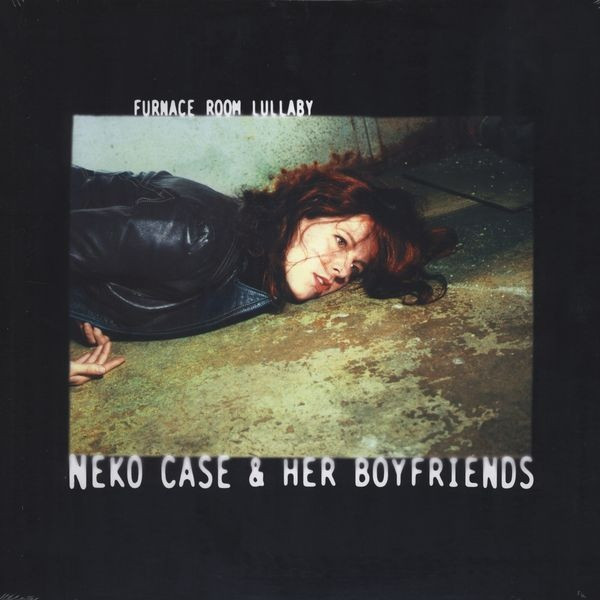

<!-- section break -->

1. Set Out Running
2. Guided By Wire
3. Porchlight
4. Mood To Burn Bridges
5. No Need To Cry
6. Twist The Knife
7. Thrice All American
8. We've Never Met
9. Whip The Blankets
10. South Tacoma Way
11. Bought And Sold
12. Furnace Room Lullaby

<!-- section break -->

## Videos
### We've Never Met
 

### More Videos

- [Set Out Running](https://www.youtube.com/watch?v=HTPJq30ghBA)
- [Neko Case Furnace Room Lullaby from The Gift](https://www.youtube.com/watch?v=9nBt_e9tzdQ)
- [Guided By Wire](https://www.youtube.com/watch?v=sCwg05ayU6o)
- [Neko Case & Her Boyfriends - Mood to Burn Bridges](https://www.youtube.com/watch?v=_s6DQSIjTFs)
- [Mood to Burn Bridges](https://www.youtube.com/watch?v=qKdDcwdygos)
- [Thrice All American](https://www.youtube.com/watch?v=lT4QMN93g9o)
- [South Tacoma Way](https://www.youtube.com/watch?v=k8iz8oNzOxM)
- [Neko Case - Furnace Room Lullaby](https://www.youtube.com/watch?v=jttWyvL6iIM)
- [Neko Case - Furnace Room Lullaby [Live from Austin, TX]](https://www.youtube.com/watch?v=lz2gMJqtIz4)

## Release Information
|  Key           | Value                                                |
| ---------------| ---------------------------------------------------- |
| Release Year   | 2016                                   |
| Discogs Link   | [Neko Case & Her Boyfriends - Furnace Room Lullaby](https://www.discogs.com/release/8197021-Neko-Case-Her-Boyfriends-Furnace-Room-Lullaby) |
| Label          | Anti- |
| Format         | Vinyl LP Album Limited Edition Reissue (Clear w/ Red, Gatefold) |
| Catalog Number | #86915-1 |
| Notes | Download card included.  "#86915-1" is on the spine "99976-1" is on the sticker that states that the download card is included "86915-1CRM (Clear/Red)" is on the bar code sticker  Copyright is 2015 but the lp was reissued on March 4th, 2016.   |