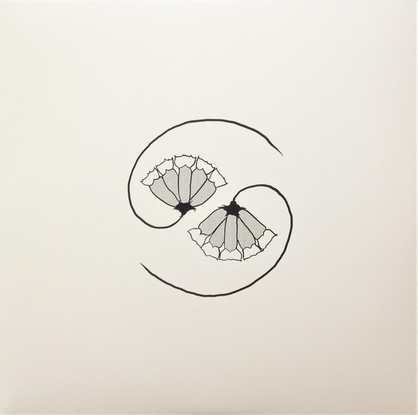

<!-- section break -->

1. A Military Alphabet (Five Eyes All Blind) (4521.0kHz 6730.0kHz 4109.09kHz) / Job’s Lament / First Of The Last Glaciers / Where We Break How We Shine (Rockets For Mary)
2. Fire At Static Valley
3. “Government Came” (9980.0kHz 3617.1kHz 4521.0 kHz) / Cliffs Gaze / Cliffs’ Gaze At Empty Waters’ Rise / Ashes To Sea Or Nearer To Thee
4. Our Side Has To Win (For D.H.)

<!-- section break -->

## Spotify


## Release Information
|  Key           | Value                                                |
| ---------------| ---------------------------------------------------- |
| Release Year   | 2021                                   |
| Discogs Link   | [Godspeed You Black Emperor! - G_d's Pee At State's End!](https://www.discogs.com/release/18068767-Godspeed-You-Black-Emperor-G_ds-Pee-At-States-End) |
| Label          | Constellation |
| Format         | Vinyl LP (180 g), Vinyl 10" 33 ⅓ RPM EP, All Media Album |
| Catalog Number | CST156 |
| Notes | Tracked live at the almighty hotel2tango, 6-11 octobre 2020. Edits and overdubs 12-18 octobre 2020. Mastered at Greymarket.  Released in a gatefold cover with b/w printed inner sleeves. Comes with label insert.  This release is auto-coupled: the LP contains sides A and 3, while the 10" contains sides B and 4. The record labels name the sides 12A, 12B, 10A & b (the b side of the 10 inch is labeled simply 'b').  The cover refers to the order of the tracks as sides A (12" A side), B (10" A side), 3 (12" B side) & 4 (10" b side)  For additional clarity: the 12" contains what is referred to as sides A and 3 (where Side 3 contains a locked groove) and the 10" has sides B & 4.  Side 3 (12" side labeled 12B) ends with a locked groove.  The writing on the label of the 10" side b (AKA "Side 4) is in Yiddish; "מיך וועלן זיי איבערלעבן". The correct spelling for the word is "מיך וועלן זיי איבערלעבד" (Translation: We will outlive them).  Housed in an embossed gatefold sleeve and includes a DL card.  Some pre-orders at independent record stores included a promo poster.  The back cover features logos of [l1285790] and [l56231]. |