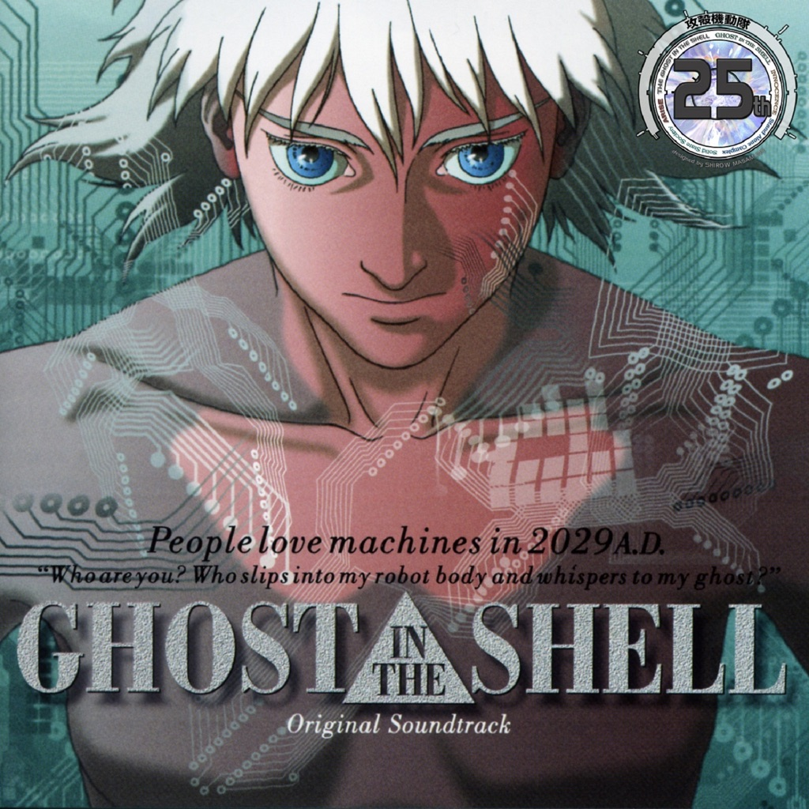

<!-- section break -->

1. M01 謡I - Making Of Cyborg
2. M02 Ghosthack (本編未使用)
3. EXM Puppetmaster
4. M04 Virtual Crime
5. M05 謠 II - Ghost City
6. M06 Access
7. M07 Nightstalker
8. M08 Floating Museum
9. M09 Ghostdive
10. M10 謠 III - Reincarnation
11. Bonus 7"
12. 挿入歌 毎天見一見! (See You Everyday) 

<!-- section break -->

## Videos
### Ghost In The Shell (1995) OST
 

### More Videos

- [M01 Chant I - Making of Cyborg - Kenji Kawai (Ghost in the Shell Soundtrack)](https://www.youtube.com/watch?v=iTPNaUsjksM)
- [Ghost in the Shell OST - Floating Museum](https://www.youtube.com/watch?v=S9579XgUUds)
- [Kenji Kawai – 謡II - Ghost City [1995] HQ HD](https://www.youtube.com/watch?v=T1lFE39E1Tc)

## Release Information
|  Key           | Value                                                |
| ---------------| ---------------------------------------------------- |
| Release Year   | 2017                                   |
| Discogs Link   | [Kenji Kawai - Ghost In The Shell (Original Soundtrack)](https://www.discogs.com/release/10522236-Kenji-Kawai-Ghost-In-The-Shell-Original-Soundtrack) |
| Label          | We Release Whatever The Fuck We Want Records |
| Format         | Vinyl LP, Vinyl 7" 45 RPM Single Sided, All Media Album Limited Edition Misprint Reissue Stereo |
| Catalog Number | WRWTFWW017LTD |
| Notes | Misprint: white characters "攻殻機動隊" (Ghost In The Shell) on obi are missing. Version with correct printed obi strip: [r10806721].  Hype sticker reads: "First official release on vinyl."  Housed in sleeve with silver hot foil embossed print, obi, and 24-page liner notes booklet. |