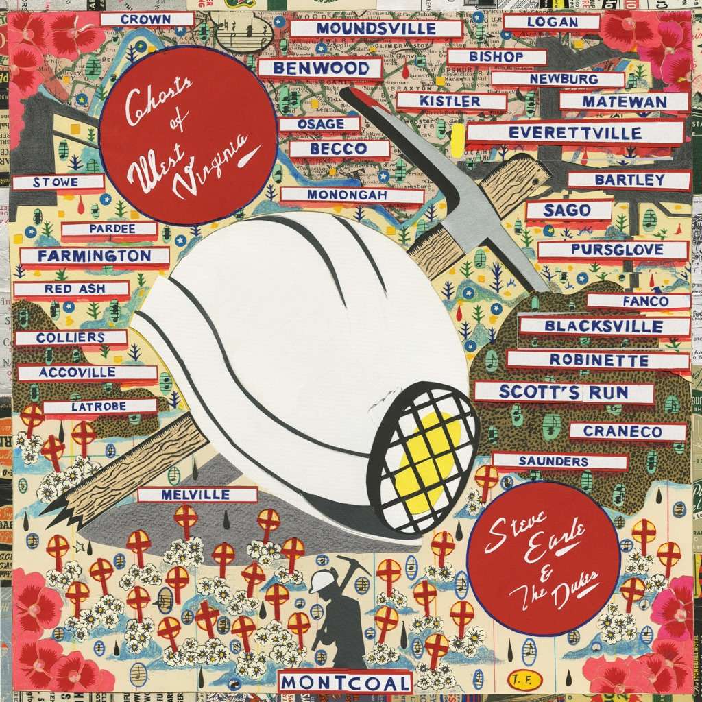

<!-- section break -->

1. Heaven Ain't Goin' Nowhere (1:39)
2. Union, God And Country (2:23)
3. Devil Put The Coal In The Ground (2:54)
4. John Henry Was A Steel Drivin' Man (3:28)
5. Time Is Never On Our Side (2:55)
6. It's About Blood (4:34)
7. If I Could See Your Face Again (2:57)
8. Black Lung (3:20)
9. Fastest Man Alive (2:51)
10. The Mine (2:48)

<!-- section break -->

## Spotify


## Videos
### Union, God and Country: A Livestream Performance of Ghosts of West Virginia + Q&A
 

### More Videos

- [Steve Earle & The Dukes - Devil Put the Coal in the Ground [Audio Only]](https://www.youtube.com/watch?v=d5tOkJK8DUk)
- [Steve Earle & The Dukes - It's About Blood [Audio Only]](https://www.youtube.com/watch?v=iKWPjr0NPQo)

## Release Information
|  Key           | Value                                                |
| ---------------| ---------------------------------------------------- |
| Release Year   | 2020                                   |
| Discogs Link   | [Steve Earle & The Dukes - Ghosts Of West Virginia](https://www.discogs.com/release/15330013-Steve-Earle-The-Dukes-Ghosts-Of-West-Virginia) |
| Label          | New West Records |
| Format         | Vinyl LP Album Limited Edition Mono (Blue & Gold West Virginia) |
| Catalog Number | NW5397 |
| Notes | Indie "blue and gold" limited edition pressing.  Includes 4-page printed insert containing photographs, lyrics and credits.  Some copies included a turntable slip mat containing the album cover artwork.  |