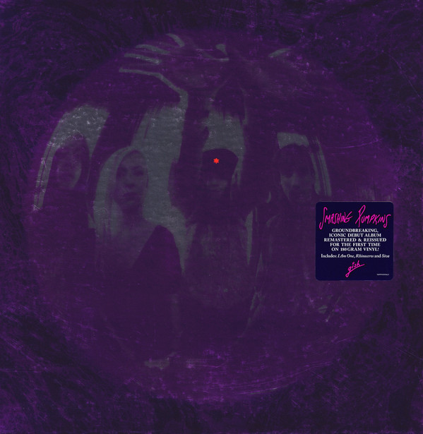

<!-- section break -->

1. I Am One
2. Siva
3. Rhinoceros
4. Bury Me
5. Crush
6. Suffer
7. Snail
8. Tristessa
9. Window Paine
10. Daydream
11. I'm Going Crazy

<!-- section break -->

## Spotify


## Videos
### Snail (Remastered 2011)
 

### More Videos

- [Smashing Pumpkins - 1991 - Gish (2011 Remastered Vinyl)[RAWrip]{VM95ML☆ifi Zen Phono}](https://www.youtube.com/watch?v=E2RDyA8id0A)
- [The Smashing Pumpkins - I Am One (Official Music Video)](https://www.youtube.com/watch?v=Pi6RJmUNBbw)
- [The Smashing Pumpkins - Siva (Official Music Video)](https://www.youtube.com/watch?v=F3wAtWywrP4)
- [The Smashing Pumpkins - Rhinoceros (Official Music Video)](https://www.youtube.com/watch?v=aVfWx9282y0)
- [Bury Me (Remastered 2011)](https://www.youtube.com/watch?v=B15BrotSE68)
- [Crush (Remastered 2011)](https://www.youtube.com/watch?v=QJLFets4aHQ)
- [The Smashing Pumpkins - Crush](https://www.youtube.com/watch?v=St0--qAA7yg)
- [Suffer (Remastered 2011)](https://www.youtube.com/watch?v=8z5BcqMgkQ0)
- [Tristessa (Remastered 2011)](https://www.youtube.com/watch?v=-n-0mbX5E4w)

## Release Information
|  Key           | Value                                                |
| ---------------| ---------------------------------------------------- |
| Release Year   | 2011                                   |
| Discogs Link   | [The Smashing Pumpkins - Gish](https://www.discogs.com/release/3266516-Smashing-Pumpkins-Gish) |
| Label          | Virgin |
| Format         | Vinyl LP Album Reissue Remastered (180 Gram, Gatefold) |
| Catalog Number | 5099990959615 |
| Notes | Includes download code   [l100643] - each side of a record will often be assigned a unique identifier, e.g., S-12345, S-12346, "S-" numbers, is Rainbo's 1.25" pressing ring.   Track B6 is unlisted on label tracklist but lyrics to all songs including B6 appear in inside of gatefold.   ℗ 2011 Virgin Records America, Inc. © 2011 Virgin Records America, Inc.  |