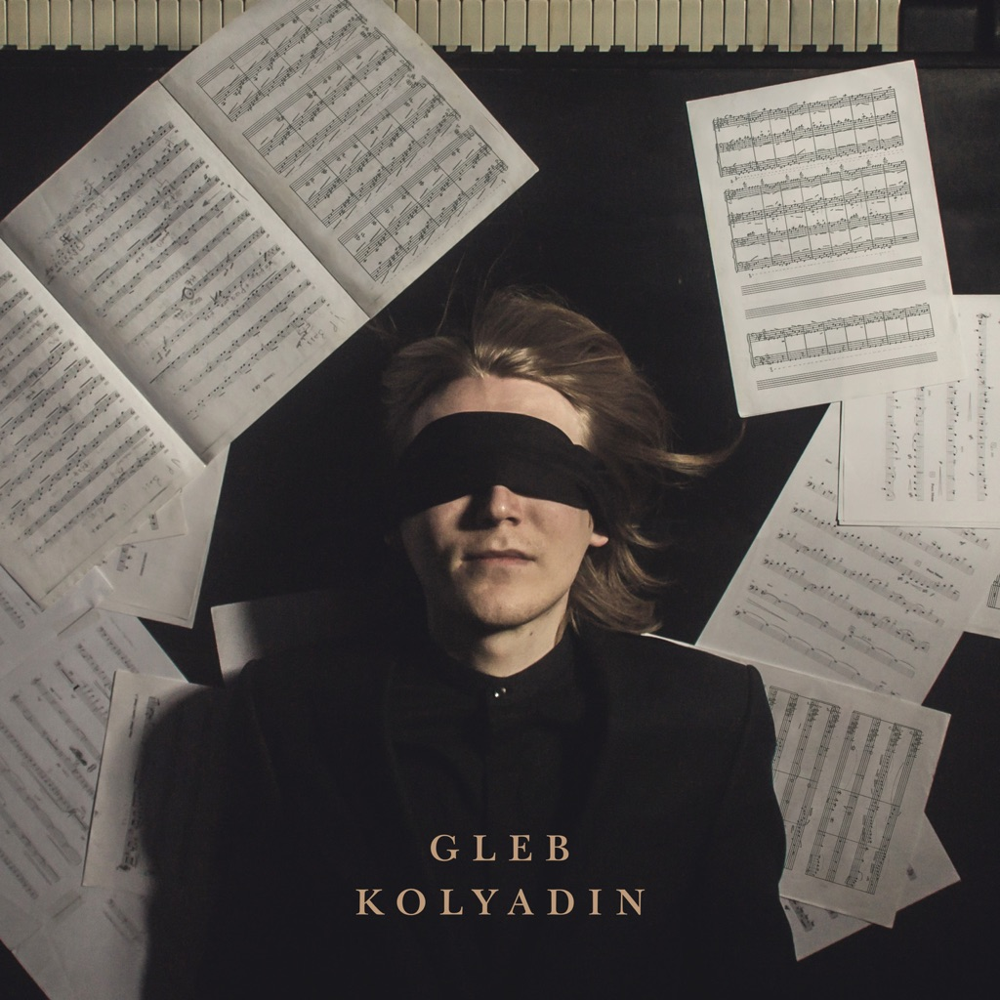

<!-- section break -->

1. Insight
2. Astral Architecture
3. Kaleidoscope
4. Eidolon
5. Into The Void
6. The Room
7. Confluence
8. Constellation
9. Echo / Sigh / Strand 
10. Penrose Stairs
11. Storyteller 
12. The Best Of Days

<!-- section break -->

## Spotify


## Videos
### Gleb Kolyadin - Storyteller (feat. Jordan Rudess, Dream Theater) (from Gleb Kolyadin)
 

### More Videos

- [Gleb Kolyadin (Iamthemorning) - The Best of Days (feat. Steve Hogarth, Marillion)](https://www.youtube.com/watch?v=Yi1uHl8uy6E)
- [Глеб КОЛЯДИН - Дебютный Альбом - 2018 / Gleb KOLYADIN - Debut Album - 2018](https://www.youtube.com/watch?v=7u7ferl0TIE)

## Release Information
|  Key           | Value                                                |
| ---------------| ---------------------------------------------------- |
| Release Year   | 2018                                   |
| Discogs Link   | [Gleb Kolyadin - Gleb Kolyadin](https://www.discogs.com/release/11631228-Gleb-Kolyadin-Gleb-Kolyadin) |
| Label          | Kscope |
| Format         | Vinyl LP Album Stereo (180 Gram) |
| Catalog Number | KSCOPE973 |
| Notes | Packaged in a single jacket in a resealable plastic sleeve with hype sticker attached to the front and printed inner sleeve that includes credits & lyrics.  Ⓟ 2018 Kscope Ⓒ 2018 Kscope  Made in the EU. |