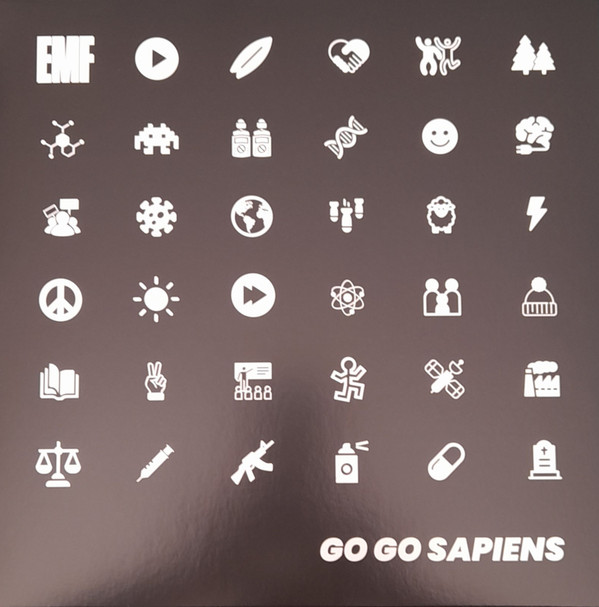

<!-- section break -->

1. Started It
2. Sister Sandinista
3. Stay Classy San Diego
4. Crime Of Passion
5. We Are The Free
6. Equilibrium
7. Keep It Coming
8. Never Die
9. Dr. Strangelove
10. Greatest Day
11. Sparks And Flashes

<!-- section break -->

## Release Information
|  Key           | Value                                                |
| ---------------| ---------------------------------------------------- |
| Release Year   | 2022                                   |
| Discogs Link   | [EMF - Go Go Sapiens](https://www.discogs.com/release/23205512-EMF-Go-Go-Sapiens) |
| Label          | Not On Label (EMF Self-released) |
| Format         | Vinyl LP Album (White ) |
| Catalog Number | EMF04 |
| Notes | Catalogue number found on spine and inner sleeve   |