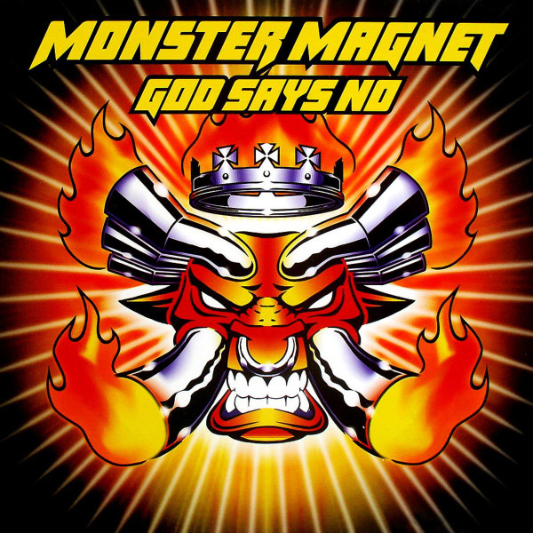

<!-- section break -->

1. Melt
2. Heads Explode
3. Doomsday
4. God Says No
5. Kiss Of The Scorpion
6. All Shook Out
7. Gravity Well
8. My Little Friend
9. Queen Of You
10. Down In The Jungle
11. Cry
12. Take It
13. Silver Future
14. I Want More (B-Side)
15. Leapin' Lizards (B-Side)
16. Into The Void
17. Black Celebration

<!-- section break -->

## Spotify


## Videos
### Monster Magnet - Down in the Jungle
 

### More Videos

- [Melt - Monster Magnet - God Says No](https://www.youtube.com/watch?v=tmbwoAeQcJ4)
- [MONSTER MAGNET - Heads Explode unedited [God Says No] [HDadv][1080p]](https://www.youtube.com/watch?v=WhJGAbBVzQw)
- [All Shook Out - Monster Magnet - God Says No](https://www.youtube.com/watch?v=luq69m7Sp-g)
- [Monster Magnet-Queen of You (lyrics)](https://www.youtube.com/watch?v=RxFIuSVQ7vM)
- [Silver Future - Monster Magnet - God Says No](https://www.youtube.com/watch?v=kuixhLvxA5A)
- [Monster Magnet - Heads Explode](https://www.youtube.com/watch?v=lOG2hv0NM9k)
- [Monster Magnet - I Want More](https://www.youtube.com/watch?v=Yji5Keb5Nko)

## Release Information
|  Key           | Value                                                |
| ---------------| ---------------------------------------------------- |
| Release Year   | 2016                                   |
| Discogs Link   | [Monster Magnet - God Says No](https://www.discogs.com/release/8112114-Monster-Magnet-God-Says-No) |
| Label          | Spinefarm Records |
| Format         | Vinyl 2× LP Album Reissue Remastered |
| Catalog Number | 00600753637845 |
| Notes | Black vinyl. Includes sleeve-notes & bonus tracks, cover material and a free album download code.  Original sound recording made by A & M Records Ltd. Tracks C4 and D1 to D4 are bonus tracks.  Recorded at The Warehouse, Vancouver, B.C. Canada Mixed at the Armoury, Vancouver, BC, Canada. Mixed at Rak Studios, London, England. Mixed at The Warehouse, Vancouver, BC, Canada.  ℗ & © 2015 Spinefarm Records. A Universal Music Group Company  Made in the EU. |