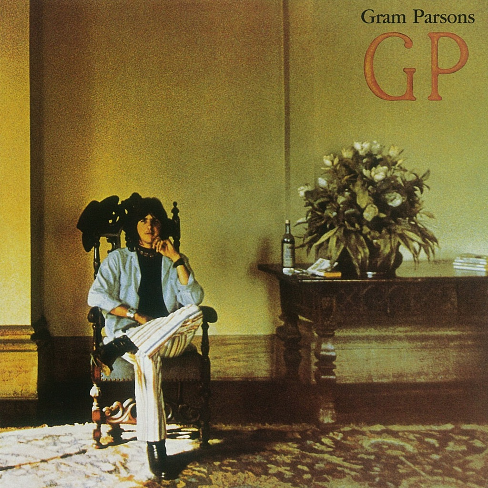

<!-- section break -->

1. Still Feeling Blue (2:38)
2. We'll Sweep Out The Ashes In The Morning (3:13)
3. A Song For You (4:57)
4. Streets Of Baltimore (2:50)
5. She (4:55)
6. That's All It Took (2:57)
7. The New Soft Shoe (3:52)
8. Kiss The Children (2:50)
9. Cry One More Time (3:55)
10. How Much I've Lied (2:27)
11. Big Mouth Blues (3:52)

<!-- section break -->

## Spotify


## Videos
### The New Soft Shoe (Remastered Version)
 

### More Videos

- [Still Feeling Blue (Remastered Version)](https://www.youtube.com/watch?v=zmu6jygpD00)
- [We'll Sweep out the Ashes in the Morning (2007 Remaster)](https://www.youtube.com/watch?v=V8c2SI1bq1E)
- [A Song for You (Remastered Version)](https://www.youtube.com/watch?v=unohYEFELoo)
- [Streets of Baltimore (2007 Remaster)](https://www.youtube.com/watch?v=Xi0c2clOqp0)
- [She (Remastered Version)](https://www.youtube.com/watch?v=iNw-6L_gsEQ)
- [That's All It Took (Remastered Version)](https://www.youtube.com/watch?v=3m0XfpIWYic)
- [Kiss the Children (Remastered Version)](https://www.youtube.com/watch?v=gkatnTSEAcY)
- [Cry One More Time (Remastered Version)](https://www.youtube.com/watch?v=Lt2AsJl_zzc)
- [How Much I've Lied (Remastered Version)](https://www.youtube.com/watch?v=WhGP3bGaFxY)
- [Big Mouth Blues (Remastered Version)](https://www.youtube.com/watch?v=u9YANfKuPt4)

## Release Information
|  Key           | Value                                                |
| ---------------| ---------------------------------------------------- |
| Release Year   | 2014                                   |
| Discogs Link   | [Gram Parsons - GP](https://www.discogs.com/release/5886669-Gram-Parsons-GP) |
| Label          | Reprise Records |
| Format         | Vinyl LP Album Reissue (180g, Gatefold) |
| Catalog Number | 8122795953 |
| Notes | ℗ & © 1973 Warner Bros. Records Inc  Manufactured in the EU.  |