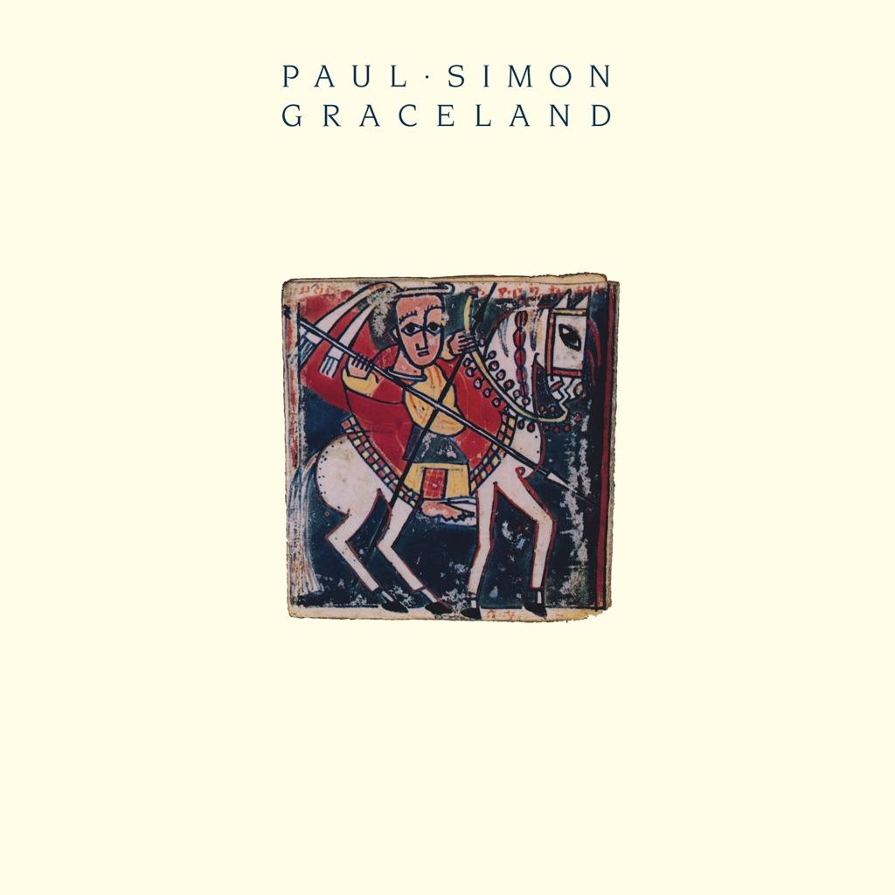

<!-- section break -->

1. The Boy In The Bubble (3:59)
2. Graceland (4:48)
3. I Know What I Know (3:13)
4. Gumboots (2:42)
5. Diamonds On The Soles Of Her Shoes (5:34)
6. You Can Call Me Al (4:39)
7. Under African Skies (3:34)
8. Homeless (3:45)
9. Crazy Love Vol II (4:17)
10. That Was Your Mother (2:51)
11. All Around The World Or The Myth Of Fingerprints (3:15)

<!-- section break -->

## Spotify


## Videos
### Paul Simon - Graceland Full Album
 

## Release Information
|  Key           | Value                                                |
| ---------------| ---------------------------------------------------- |
| Release Year   | 1986                                   |
| Discogs Link   | [Paul Simon - Graceland](https://www.discogs.com/release/5416395-Paul-Simon-Graceland) |
| Label          | Warner Bros. Records |
| Format         | Vinyl LP Album (Embossed) |
| Catalog Number | WX 52 |
| Notes | All Rights in the U.K. & Eire controlled by Pattern M. Ltd. Embossed horseman picture on front cover (very slightly raised). |