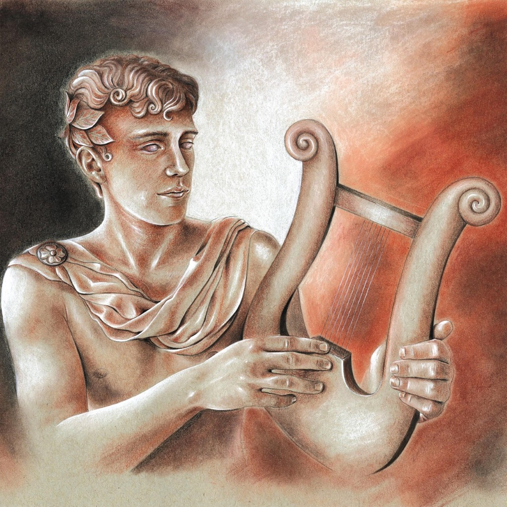

<!-- section break -->

1. Novum Organum (2:25)
2. Alive (4:34)
3. The Florentine (8:17)
4. Roman Stone (13:33)
5. Pantheon (6:12)
6. Theodora In Green And Gold (5:32)
7. Ariel (14:28)
8. Voyager (14:20)
9. Homesong (4:50)

<!-- section break -->

## Spotify


## Videos
### Big Big Train - Theodora in Green and Gold
 

## Release Information
|  Key           | Value                                                |
| ---------------| ---------------------------------------------------- |
| Release Year   | 2019                                   |
| Discogs Link   | [Big Big Train - Grand Tour](https://www.discogs.com/release/13635083-Big-Big-Train-Grand-Tour) |
| Label          | Plane Groovy |
| Format         | Vinyl 2× LP Album Limited Edition Stereo (180 Gram, Cream) |
| Catalog Number | PLG074 |
| Notes | Limited edition vinyl release that includes a 24-page booklet with full color graphics, lyrics, credits, and band explanations for the inspiration and/or story behind each song. Some copies ordered through Burning Shed were sent a BBT concert flyer for upcoming performances and a Burning Shed postcard.  |