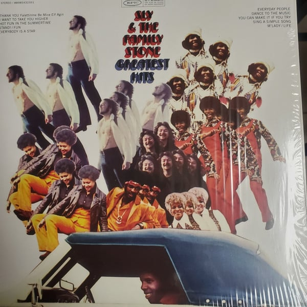

<!-- section break -->

1. I Want To Take You Higher (5:22)
2. Everybody Is A Star (3:00)
3. Stand! (3:08)
4. Life (2:58)
5. Fun (2:20)
6. You Can Make It If You Try (3:39)
7. Dance To The Music (2:58)
8. Everyday People (2:20)
9. Hot Fun In The Summertime (2:37)
10. M'Lady (2:44)
11. Sing A Simple Song (4:47)
12. Thank You (Falettinme Be Mice Elf Agin) (3:55)

<!-- section break -->

## Spotify


## Videos
### M'Lady
 

### More Videos

- [Sly & The Family Stone - Hot Fun in the Summertime (Official Audio)](https://www.youtube.com/watch?v=Bg0tFRea0wA)
- [Sly & The Family Stone - Everybody Is a Star (Official Audio)](https://www.youtube.com/watch?v=3-1s2gqDs_U)
- [Stand!](https://www.youtube.com/watch?v=Al0WUPn_CnM)
- [I Want To Take You Higher](https://www.youtube.com/watch?v=GZrsNne4XhM)
- [Everyday People](https://www.youtube.com/watch?v=bsxM-zuKdmQ)
- [Life](https://www.youtube.com/watch?v=dbD1UVjr39s)

## Release Information
|  Key           | Value                                                |
| ---------------| ---------------------------------------------------- |
| Release Year   | 2017                                   |
| Discogs Link   | [Sly & The Family Stone - Greatest Hits](https://www.discogs.com/release/11281399-Sly-The-Family-Stone-Greatest-Hits) |
| Label          | Epic |
| Format         | Vinyl LP Compilation |
| Catalog Number | 88985432351 |
| Notes |   |