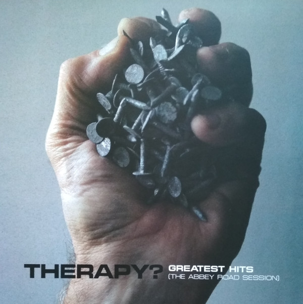

<!-- section break -->

1. Teethgrinder
2. Screamager
3. Opal Mantra
4. Turn
5. Nowhere
6. Trigger Inside
7. Die Laughing
8. Stories
9. Loose
10. Diane
11. Church Of Noise
12. Lonely, Cryin' Only

<!-- section break -->

## Videos
### Therapy? (ft. James Dean Bradfield) - Die Laughing (2020 Version) (Official Lyric Video)
 

## Release Information
|  Key           | Value                                                |
| ---------------| ---------------------------------------------------- |
| Release Year   | 2020                                   |
| Discogs Link   | [Therapy? - Greatest Hits (The Abbey Road Session)](https://www.discogs.com/release/14911724-Therapy-Greatest-Hits-The-Abbey-Road-Session) |
| Label          | Marshall Records (10) |
| Format         | Vinyl LP Album |
| Catalog Number | R920.011 |
| Notes | Autographed copies were available to pre-order from the band's webstore (these copies didn't come shrink-wrapped, but in a resealable polypropylene cover).  Catalog# and barcode differ from those on the coloured vinyl edition. |