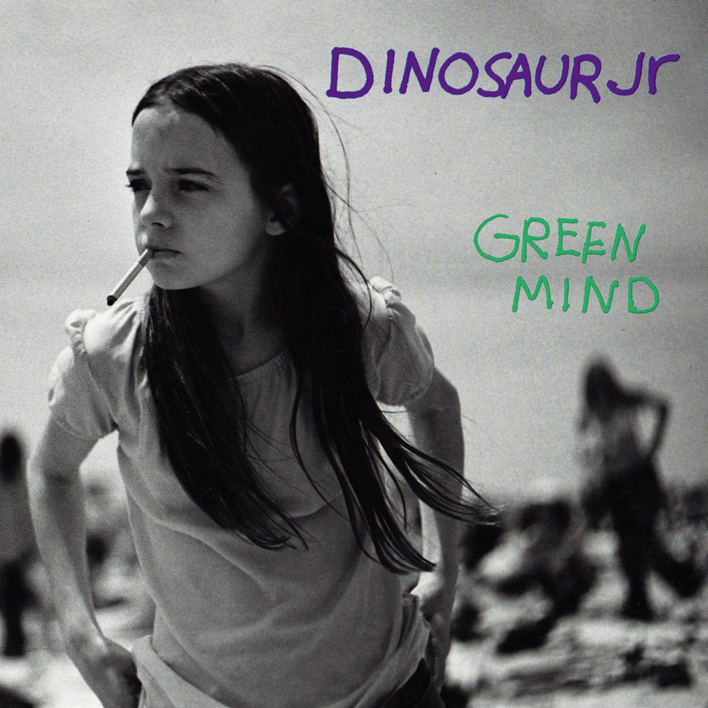

<!-- section break -->

1. The Wagon
2. Puke + Cry
3. Blowing It
4. I Live For That Look
5. Flying Cloud
6. How'd You Pin That One On Me
7. Water
8. Muck
9. Thumb
10. Green Mind
11. Pebbles + Weeds
12. The Little Baby
13. Not You Again
14. Quicksand (Wagon Reprise)
15. Throw Down
16. Whatever's Cool With Me
17. Sideways
18. Thumb (Live)
19. Keep The Glove (Live)
20. The Lung (Live)
21. The Post (Live)

<!-- section break -->

## Spotify


## Videos
### Dinosaur Jr The Wagon
 

## Release Information
|  Key           | Value                                                |
| ---------------| ---------------------------------------------------- |
| Release Year   | 2019                                   |
| Discogs Link   | [Dinosaur Jr. - Green Mind](https://www.discogs.com/release/14193595-Dinosaur-Jr-Green-Mind) |
| Label          | Cherry Red |
| Format         | Vinyl LP Album (Green), Vinyl LP Compilation (Green), All Media Deluxe Edition Reissue Remastered |
| Catalog Number | PBREDD756 |
| Notes | Includes printer inner sleeves with a review and interviews with the band.  ℗ 2019 Cherry Red Records Ltd. This compilation © 2019 Cherry Red Records Ltd. Power Road Studios, 114 Power Road, London W4 5PY www.cherryred.co.uk Made in EU  Green mind: Drums recorded at Sorcerer Sound. Other stuff recorded at Fort Apache North Mixed at White Crow Audio  'Whatever's Cool With Me' EP recorded all over the place [...]  'Green Mind' released February 1991. Side C, tracks 1-5: 'The Wagon' Single B-Sides released January 1991. Side C, track 6 and side D, tracks 1-3: 'Whatever's Cool With Me' EP released August 1991. Side D, tracks 4-5: 'Whatever's Cool With Me' EP (Japanese edition only) released November 1991.  All tracks [...] Published by Spam As The Bread Music/BMG Blue/BMG Rights Management (UK) Ltd.  Pre-order came with pin 4x4 cm (compare photos). |