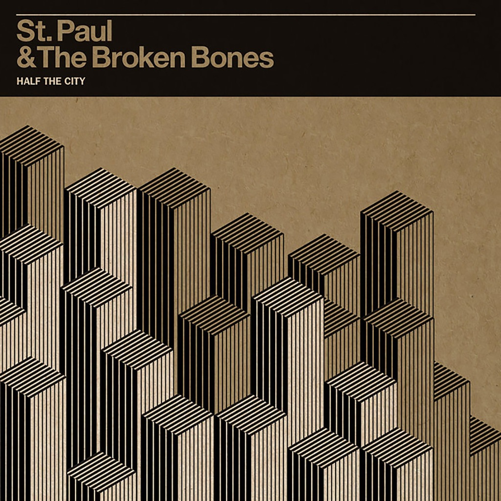

<!-- section break -->

1. I'm Torn Up (3:37)
2. Don't Mean A Thing (3:06)
3. Call Me (2:51)
4. Like A Mighty River (3:23)
5. That Glow (3:04)
6. Broken Bones & Pocket Change (3:47)
7. Sugar Dyed (2:28)
8. Half The City (3:17)
9. Grass Is Greener (4:14)
10. Let It Be So (3:19)
11. Dixie Rothko (3:32)
12. It's Midnight (2:31)

<!-- section break -->

## Spotify


## Videos
### St. Paul and the Broken Bones - Half the City
 

## Release Information
|  Key           | Value                                                |
| ---------------| ---------------------------------------------------- |
| Release Year   | 2014                                   |
| Discogs Link   | [St. Paul & The Broken Bones - Half The City](https://www.discogs.com/release/5421968-St-Paul-The-Broken-Bones-Half-The-City) |
| Label          | Single Lock Records |
| Format         | Vinyl LP Album Stereo (180 Gram) |
| Catalog Number | SL 003 |
| Notes | Includes printed inner sleeve and download coupon for entire album in MP3 format.    Recorded at The Nutthouse except "Sugar Dyed" was recorded at Ol' Elegante Studios. Additional overdubs recorded at Up and In Studio.  Mixed at FAME Studio A    © and ℗ 2014 Single Lock Records |