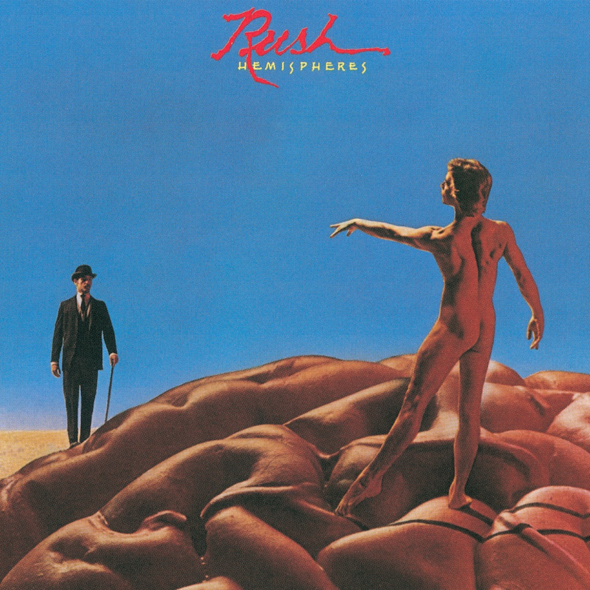

<!-- section break -->

1. Cygnus X-1 Book II: Hemispheres (18:07)
2. Circumstances (3:42)
3. The Trees (4:46)
4. La Villa Strangiato (9:36)

<!-- section break -->

## Spotify


## Release Information
|  Key           | Value                                                |
| ---------------| ---------------------------------------------------- |
| Release Year   | 2015                                   |
| Discogs Link   | [Rush - Hemispheres](https://www.discogs.com/release/7036854-Rush-Hemispheres) |
| Label          | Mercury |
| Format         | Vinyl LP Album Reissue Remastered (Gatefold, 180g) |
| Catalog Number | 00602547118066 |
| Notes | Issued in a gatefold sleeve. Includes a voucher to download mp3 version of the album and a poster    Recorded at Rockfield Studios, Wales, during June and July 1978  Vocals recorded at Advision Studios, London  Mixed at Trident Studios, Soho, London, August 1978  Direct Metal Mastering at Abbey Road Mastering Studios - December 2014    ℗ © 2015 Mercury Records, a division of UMG Recordings, Inc.  Made in the EU    Similar entry is the [url=http://www.discogs.com/release/7025925]USA & Canada[/url] release |