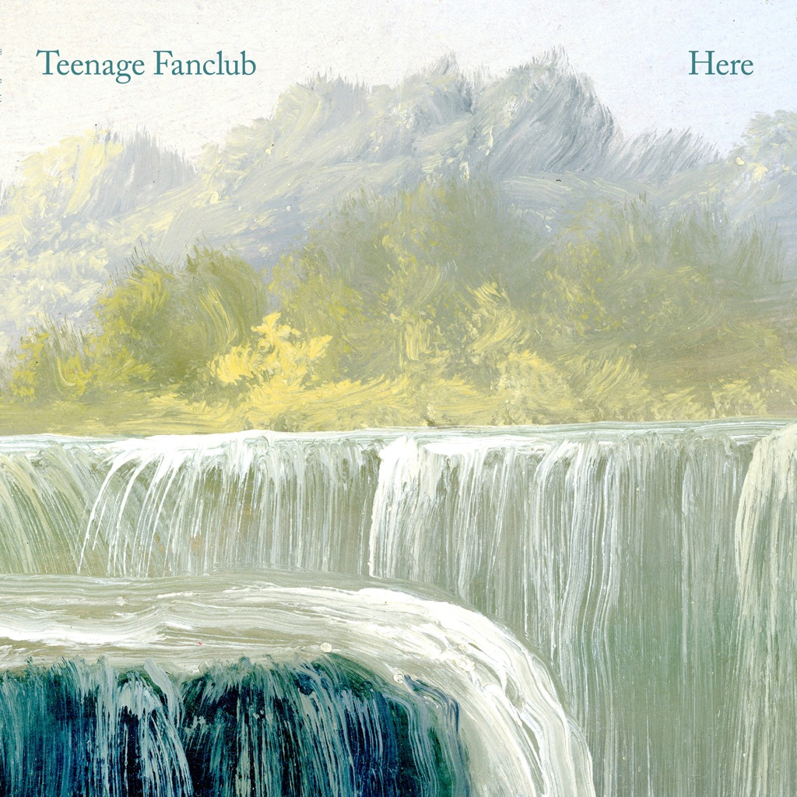

<!-- section break -->

1. I'm In Love
2. Thin Air
3. Hold On
4. The Darkest Part Of The Night
5. I Have Nothing More To Say
6. I Was Beautiful When I Was Alive
7. The First Sight
8. Live In The Moment
9. Steady State
10. It's A Sign
11. With You
12. Connected To Life

<!-- section break -->

## Spotify


## Videos
### Teenage Fanclub - Thin Air
 

### More Videos

- [Teenage Fanclub - I'm In Love](https://www.youtube.com/watch?v=FDOLKSp2AWU)

## Release Information
|  Key           | Value                                                |
| ---------------| ---------------------------------------------------- |
| Release Year   | 2016                                   |
| Discogs Link   | [Teenage Fanclub - Here](https://www.discogs.com/release/9023353-Teenage-Fanclub-Here) |
| Label          | Pema |
| Format         | Vinyl LP Album |
| Catalog Number | PEMA009LP |
| Notes | Includes download code coupon and a printed inner sleeve.  ℗ & © 2016 PeMa  Recorded at Vega Studio, nr Carpentras, Provence and at Raymond's place in Pollokshields, Glasgow. Mixed at Clouds Hill Recordings in Hamburg. Assistant engineers: Bertrand Montandon and Quentin Tillie at Vega, and Linda Gerdes and Sebastian Muxfeldt at Clouds Hill. Mastered by Sean Magee at Abbey Road. |