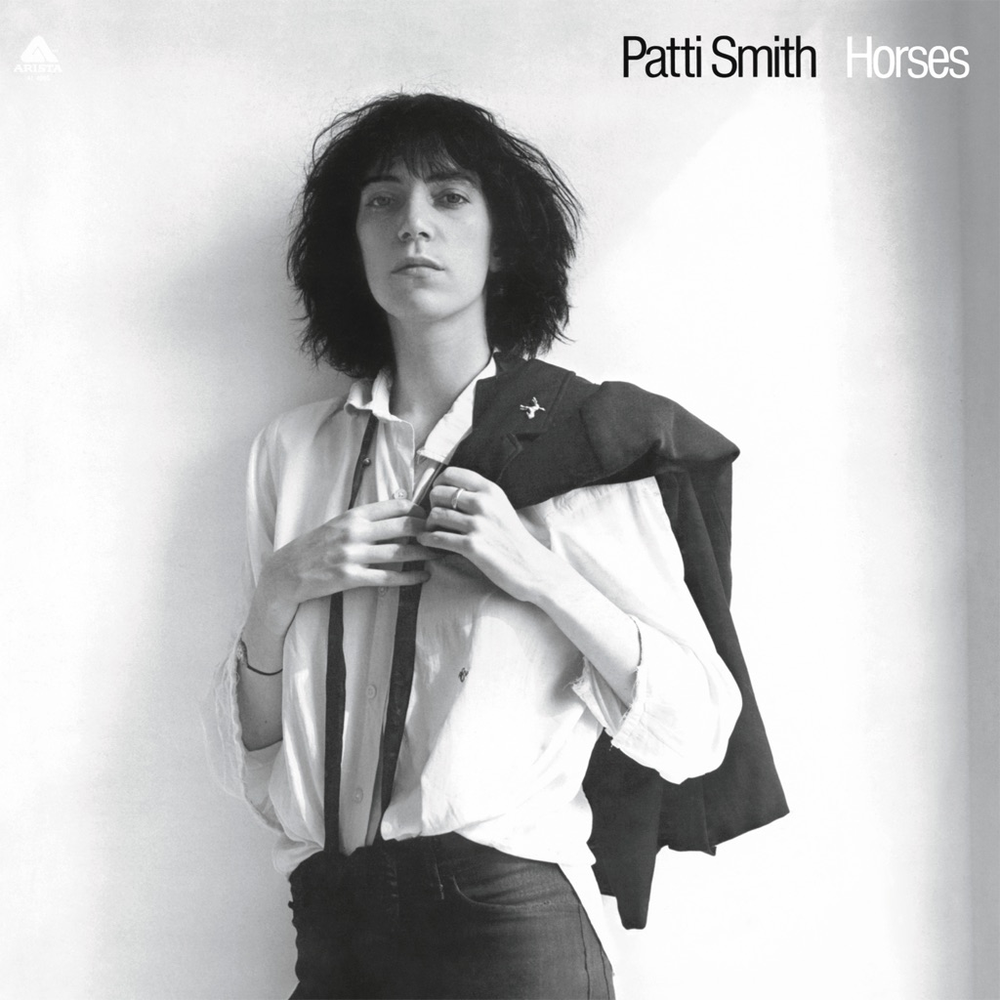

<!-- section break -->

1. Gloria
2. Redondo Beach
3. Birdland
4. Free Money
5. Kimberly
6. Break It Up
7. Land
8. Elegie

<!-- section break -->

## Spotify


## Videos
### Land: Horses / Land of a Thousand Dances / La Mer (de)
 

### More Videos

- [Patti Smith ‎Horses Full Album](https://www.youtube.com/watch?v=SVR_eY_1R40)
- [Patti Smith - Gloria (Audio)](https://www.youtube.com/watch?v=bPO0bTaWcFQ)
- [Patti Smith - Horses   Full Album](https://www.youtube.com/watch?v=yoRFG1oef2I)

## Release Information
|  Key           | Value                                                |
| ---------------| ---------------------------------------------------- |
| Release Year   | 2019                                   |
| Discogs Link   | [Patti Smith - Horses](https://www.discogs.com/release/14504020-Patti-Smith-Horses) |
| Label          | Arista |
| Format         | Vinyl LP Album Limited Edition Reissue (Clear) |
| Catalog Number | 19075995581 |
| Notes | Clear Vinyl Rough Trade Exclusive Limited to 1000 copies 2019 Rough Trade Exclusive Edition with 'Rough Trade Essentials' Obi Strip |