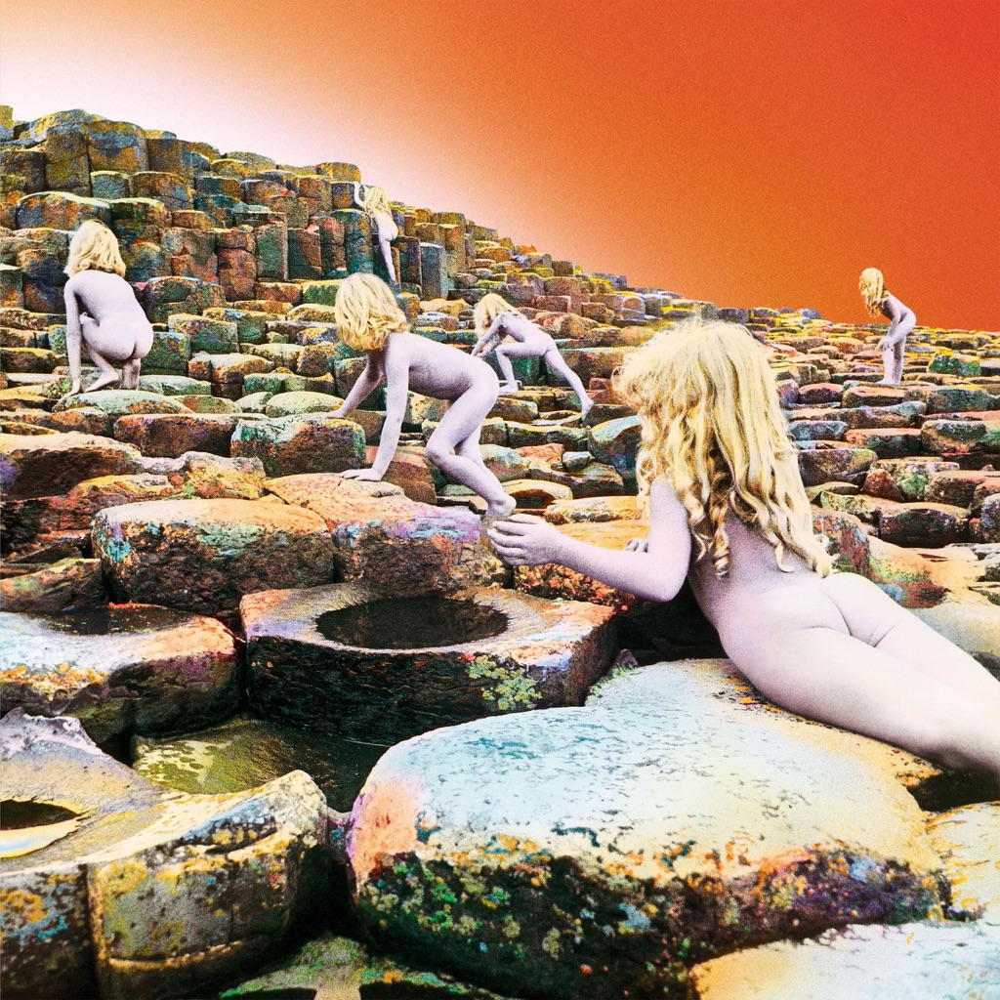

<!-- section break -->

1. The Song Remains The Same (5:29)
2. The Rain Song (7:39)
3. Over The Hills And Far Away (4:50)
4. The Crunge (3:17)
5. Dancing Days (3:43)
6. D'yer Mak'er (4:22)
7. No Quarter (7:02)
8. The Ocean (4:31)

<!-- section break -->

## Spotify


## Release Information
|  Key           | Value                                                |
| ---------------| ---------------------------------------------------- |
| Release Year   | 2014                                   |
| Discogs Link   | [Led Zeppelin - Houses Of The Holy](https://www.discogs.com/release/6224441-Led-Zeppelin-Houses-Of-The-Holy) |
| Label          | Atlantic |
| Format         | Vinyl LP Album Reissue Remastered Stereo (180 Gram, Gatefold) |
| Catalog Number | 8122796573 |
| Notes | 180 gram vinyl housed in a gatefold jacket and issued in a white poly lined inner sleeve. The gatefold jacket is sealed with a white bellyband including the following printed text: Front : Led Zeppelin Houses Of The Holy Back : [Atlantic logo] 8122796573 Includes an 11" x 11" thick velum style paper insert with lyrics and band line-up.  Runouts are entirely etched, and where [l313190]'s faintly inscribed geometric marks appear, these are mirrored: Variant 2: Side A '51▽', side B '1 11 -' Variant 3: Side A '3=1', side B '4V1' Variant 4: Side A '3+X', side B '4 T T' Variant 5: Side A '2VT', side B '41–' Due to the nature of the hand etching, it can sometimes appear that there is a space between the letters and numbers of the Optimal Media GmbH identifiers. However, as per the Optimal Media GmbH label page, their runout scheme "is in fact always without spaces."  [Sticker:] The classic album on 180g vinyl Remastered & produced by Jimmy Page  [Insert:] Recorded at Rolling Stones Mobile Studio at Stargroves (Hampshire), Island Studio (London), Olympic Studios (London) ℗ & © 1973 Atlantic Recording Corporation, a Warner Music Group Company. [...] All lyrics administered by WB Music Corp. (ASCAP) Made in the EU. 8122796573  [Labels:] ℗ & © 1973 Atlantic Recording Corporation. Manufactured in Germany. |