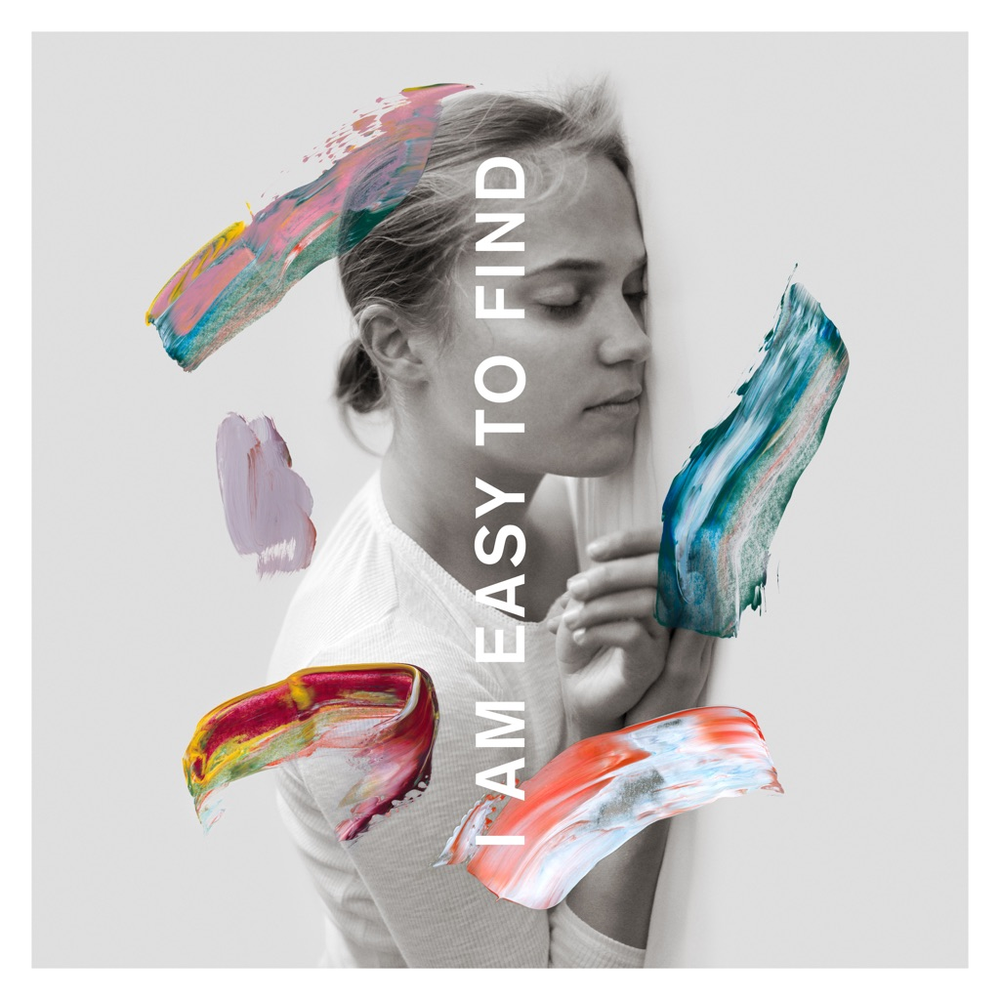

<!-- section break -->

1. You Had Your Soul With You
2. Quiet Light
3. Roman Holiday
4. Oblivions
5. The Pull Of You
6. Hey Rosey
7. I Am Easy To Find
8. Her Father In The Pool
9. Where Is Her Head
10. Not In Kansas
11. So Far So Fast
12. Dust Swirls In Strange Light
13. Hairpin Turns
14. Rylan
15. Underwater
16. Light Years
17. I Am Easy To Find (Original Film Score)

<!-- section break -->

## Spotify


## Videos
### The National - 'Light Years'
 

### More Videos

- [I Am Easy To Find - A Film by Mike Mills / An Album by The National](https://www.youtube.com/watch?v=ifElv18k2O8)
- [The National - 'Rylan'](https://www.youtube.com/watch?v=CbXnnn8z1tE)
- [The National - 'Hairpin Turns'](https://www.youtube.com/watch?v=W_aN81SBI3A)

## Release Information
|  Key           | Value                                                |
| ---------------| ---------------------------------------------------- |
| Release Year   | 2019                                   |
| Discogs Link   | [The National - I Am Easy To Find](https://www.discogs.com/release/13632090-The-National-I-Am-Easy-To-Find) |
| Label          | 4AD |
| Format         | Vinyl LP (Red), Vinyl LP (Yellow), Vinyl LP Single Sided Etched (Grey), All Media Album Limited Edition |
| Catalog Number | 4AD0154LPX |
| Notes | Triple 140 Gram Vinyl Set on Opaque Red / Yellow / Grey Colors. 5th side contains 22 minutes of music from the I Am Easy To Find Original Film Score – Exclusive to this format. Etching on the 6th side.  Tri-fold LP jacket - 3 printed innersleeves - 24 page booklet - 24” x 24” poster folder - housed in printed plastic sleeve.  Includes digital download card for tracks A1 to D4. |