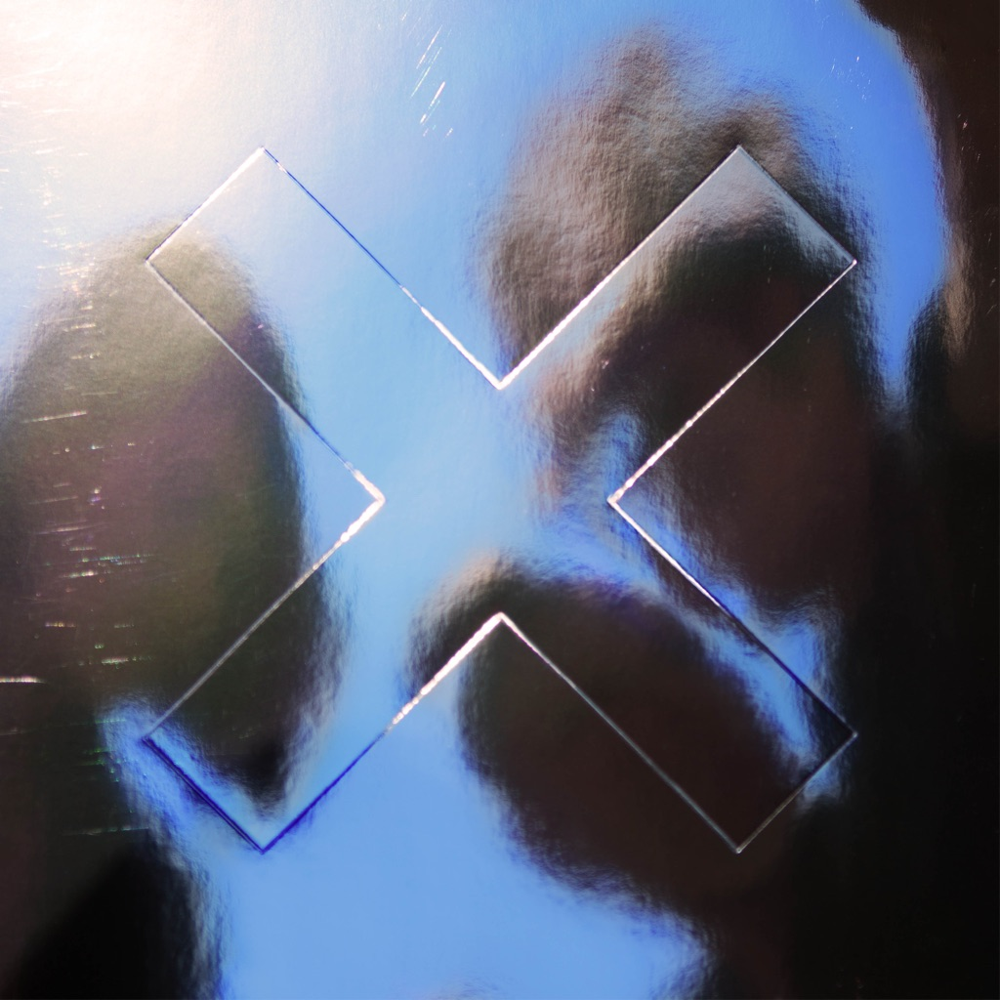

<!-- section break -->

1. Dangerous
2. Say Something Loving
3. Lips
4. A Violent Noise
5. Performance
6. Replica
7. Brave For You
8. On Hold
9. I Dare You
10. Test Me
11. Dangerous (4:11)
12. Say Something Loving (3:58)
13. Lips (3:21)
14. A Violent Noise (3:47)
15. Performance (4:06)
16. Replica (4:09)
17. Brave For You (4:13)
18. On Hold (3:44)
19. I Dare You (3:53)
20. Test Me (3:56)

<!-- section break -->

## Spotify


## Videos
### The xx - Naive (Official Audio)
 

### More Videos

- [The xx - On Hold (Official Video)](https://www.youtube.com/watch?v=blJKoXWlqJk)
- [The XX - Seasons Run](https://www.youtube.com/watch?v=9h5hOBdolWM)
- [The xx - Say Something Loving (Official Music Video)](https://www.youtube.com/watch?v=Rh2uNrIgGf4)
- [The xx - Brave For You (Marfa Demo Version)](https://www.youtube.com/watch?v=2xkkSUMstlM)
- [The xx - I Dare You (Official Music Video)](https://www.youtube.com/watch?v=qqflFMhkqHM)

## Release Information
|  Key           | Value                                                |
| ---------------| ---------------------------------------------------- |
| Release Year   | 2017                                   |
| Discogs Link   | [The XX - I See You](https://www.discogs.com/release/9596944-The-XX-I-See-You) |
| Label          | Young Turks |
| Format         | Vinyl LP Album Limited Edition (Clear), CD Album |
| Catalog Number | YTLP161V |
| Notes | Limited to 6000 copies.  Recorded between March 2014 + August 2016. "Say Something Loving" contains a sample of the recording 'Do You Feel It' as performed by Alessi. Used courtesy of A&M Records. Under license from Universal Music Enterprises. Used by permission. All rights reserved. This composition contains elements from 'Do You Feel It' by Bobby & Billy Alessi. Published by Alessi Music / The Royalty Network Inc & Bucks Music Group Limited. Also contains homage to 'The Sweetest Taboo' (Sade Adu / Martin Ditchum) published by Angel Music Ltd. / Sony / ATV Music Publishing. "Lips" contains a sample from 'Just (After Song Of Songs)' performed by Trio Mediaeval, Garth Knox, Agnès Vestermann And Sylvain Lemêtre. Recording Louth Contemporary Music, www.Louthcms.Org. Music and text - David Lang. Publisher: Red Poppy, Ltd. "On Hold" contains a sample from 'I Can't Go For That (No Can Do)' as recorded by Daryl Hall & John Oates. Used courtesy of Sony Music Entertainment. Written by S. Allen, D. Hall, J. Oates © 1981. Published by Geomantic Music (BMI) / Hot Cha Music Co. (BMI) Admin By BMG Rights Management (UK) Ltd. / Unichappell Music Inc. Admin By Warner / Chappell North America Ltd.  Stella Mozgawa appears courtesy of Rough Trade Records.  Track durations for CD have been timed using iTunes. |